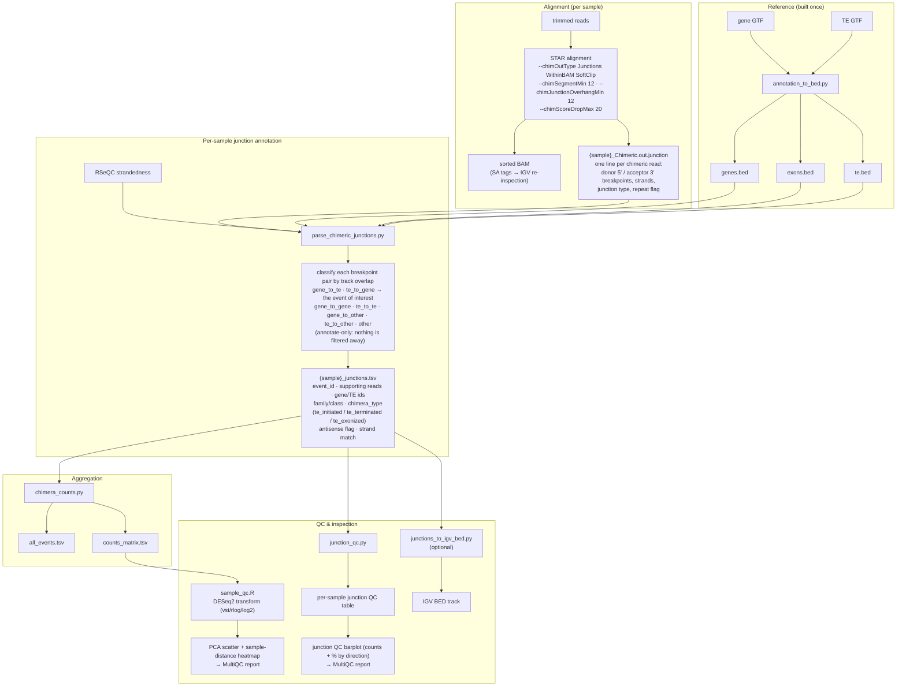

# TEtranscripts-pipe


A Snakemake workflow that quantifies genes **and** transposable elements (TEs)
from RNA-seq data with [TEtranscripts/TEcount](https://github.com/mhammell-laboratory/TEtranscripts),
aligning with STAR and auto-detecting library strandedness via RSeQC.

```mermaid
flowchart LR
    subgraph reference_once["Reference (once)"]
        star_index["STAR index"]
        gtf_to_genepred["GTF -> genePred"]
        genepred_to_bed12["genePred -> BED12"]
    end
    subgraph per_sample["Per sample"]
        cat_fastq["concat lanes"]
        trim_galore_pe["Trim Galore! (paired)"]
        trim_galore_se["Trim Galore! (single-end)"]
        star_align["STAR align"]
        samtools_sort["samtools sort"]
        samtools_index["samtools index"]
        fastqc_raw["FastQC (raw)"]
        rseqc_infer_experiment["RSeQC infer_experiment"]
        determine_strandedness["determine strandedness"]
    end
    subgraph quantification_qc["Quantification + QC"]
        tecount["TEcount"]
        tetranscripts_diffexp["TEtranscripts + DESeq2"]
        tecount_counts["tecount counts matrix"]
        tecount_qc_transform["sample-QC transform (vst/rlog/log2)"]
        tecount_qc["sample-QC plots (PCA + clustering)"]
        tecount_summary["tecount summary barplots (assignment + TE class)"]
        software_versions["software versions"]
        config_used["config used"]
        benchmark_summary["resource-usage summary"]
        multiqc["MultiQC"]
    end
    subgraph chimera_screen["Chimera screen"]
        annotation_to_bed["annotation -> BED tracks"]
        parse_chimeric_junctions["parse chimeric junctions"]
        junction_qc["junction QC"]
        junction_qc_barplot["junction QC barplot"]
        chimera_igv_bed["IGV BED track"]
        chimera_counts["chimera counts matrix"]
        sample_qc_transform["sample-QC transform"]
        sample_qc["sample-QC plots"]
    end
    subgraph other["Other"]
        cleanup_star_index["cleanup_star_index"]
    end
    annotation_to_bed --> parse_chimeric_junctions
    benchmark_summary --> multiqc
    cat_fastq --> fastqc_raw
    cat_fastq --> trim_galore_pe
    cat_fastq --> trim_galore_se
    chimera_counts --> sample_qc_transform
    determine_strandedness --> parse_chimeric_junctions
    determine_strandedness --> tecount
    determine_strandedness --> tetranscripts_diffexp
    genepred_to_bed12 --> rseqc_infer_experiment
    gtf_to_genepred --> genepred_to_bed12
    junction_qc --> junction_qc_barplot
    parse_chimeric_junctions --> chimera_counts
    parse_chimeric_junctions --> chimera_igv_bed
    parse_chimeric_junctions --> junction_qc
    rseqc_infer_experiment --> determine_strandedness
    sample_qc_transform --> sample_qc
    samtools_index --> rseqc_infer_experiment
    samtools_sort --> rseqc_infer_experiment
    samtools_sort --> samtools_index
    software_versions --> multiqc
    star_align --> cleanup_star_index
    star_align --> parse_chimeric_junctions
    star_align --> samtools_sort
    star_align --> tecount
    star_align --> tetranscripts_diffexp
    star_index --> star_align
    tecount --> tecount_counts
    tecount --> tecount_summary
    tecount_counts --> tecount_qc_transform
    tecount_qc_transform --> tecount_qc
    trim_galore_pe --> star_align
    trim_galore_se --> star_align
```

<!-- flowchart:start -->

<!-- flowchart:end -->

## Pipeline at a glance

The workflow builds a STAR index and an RSeQC gene model (BED12) **once**, then
for every sample concatenates split lanes, optionally trims with TrimGalore!,
aligns with STAR, and auto-detects library strandedness from the sorted BAM.
TEcount quantifies genes + TEs per sample (subfamily-level); TElocal provides
locus-level TE quantification from the same alignment. If your sample sheet has
a `condition` column, TEtranscripts + DESeq2 also runs every pairwise contrast.
The per-sample TEcount tables also drive a sample-QC view (PCA + sample
clustering, on by default) and per-sample summary barplots (gene-vs-TE
assignment and TE class composition), rendered inside the MultiQC report.
The **same** alignment also drives a gene-TE chimera
screen that annotates chimeric junction reads and produces a counts matrix,
an interactive sample-QC view, and a junction-QC barplot (on by default;
set `chimera.enabled: false` to opt out). A single MultiQC
report pulls together
FastQC, TrimGalore!, STAR, RSeQC, the TEcounts, TElocal, and chimera QC plots, tool
versions, and a per-rule resource-usage table.

## Table of contents

- [Quick start](#quick-start)
- [Configuration](#configuration)
- [Command-line interface](#command-line-interface)
- [Test profile](#test-profile)
- [Useful partial targets](#useful-partial-targets)
- [HPC / SLURM](#hpc--slurm)
- [Resuming & troubleshooting](#resuming--troubleshooting)
- [Resource usage & reports](#resource-usage--reports)
- [Tool versions](#tool-versions)
- [Without conda](#without-conda)
- [How strandedness is resolved](#how-strandedness-is-resolved)
- [Automatic differential analysis](#automatic-differential-analysis)
- [TEcounts sample-QC](#tecounts-sample-qc)
- [The chimera screen](#the-chimera-screen)
- [How chimeric TEs are detected](#how-chimeric-tes-are-detected)
- [Output layout](#output-layout)
- [Notes](#notes)

## Quick start

There are two ways to get the environment the workflow needs. Both give you
the same `snakemake` plus every analysis tool — pick one:

- **Option A** (recommended): a pre-built environment tarball — no conda, no
  solver; needs only `bash`/`curl`/`tar`.
- **Option B**: build it yourself with conda (needs conda ≥23.10).

### Option A — pre-built environment (no conda)

Every GitHub release ships a tarball of the complete environment
(`...-env.tar.gz`, Linux x86_64), built from `workflow/environment.yaml` in CI —
so there is nothing to install or solve. Fetch and unpack it with the helper
script (needs only `bash`/`curl`/`tar`):

```bash
git clone https://github.com/altintasali/TEtranscripts-pipe.git
cd TEtranscripts-pipe
./workflow/scripts/install-env.sh   # downloads the latest release env into $HOME/software/tetranscripts-pipe-env
source workflow/scripts/activate-env.sh   # activates it in your current shell
```

Pass `-o PREFIX` to install elsewhere (e.g. shared cluster storage) and `-r vX.Y.Z`
to pin a specific release instead of the latest. If you used a custom `-o`,
activate it the same way: `source workflow/scripts/activate-env.sh /path/to/env`. Then
continue with the setup steps below.

Re-running `install-env.sh` replaces an existing install automatically (it
prints a warning); `-f` is only needed if the target directory holds unrelated
files. `activate-env.sh` prints a one-line confirmation on activation and
errors out with a reinstall hint if the environment looks incomplete.

### Option B — build it yourself with conda

Requires conda (e.g. [Miniforge](https://github.com/conda-forge/miniforge) or
Miniconda; conda ≥23.10 already uses the fast libmamba solver, so mamba is
optional).

```bash
git clone https://github.com/altintasali/TEtranscripts-pipe.git
cd TEtranscripts-pipe
conda env create -f workflow/environment.yaml   # snakemake + every analysis tool, installed once
conda activate tetranscripts-pipe
```

### Either way, then

```bash
# Verify the install (dry-run: parses the config, prints the plan, runs nothing):
snakemake --configfile config/test.yaml -n

# Smoke test on the bundled tiny synthetic dataset (no real genome/reads needed):
snakemake --configfile config/test.yaml --cores 4

# Set up your own analysis. input/config.yaml and input/samples.csv are
# gitignored on purpose, so every clone starts as a clean project and `git
# pull` never conflicts with your analysis settings -- create them from the
# committed .example templates:
cp config/config.example.yaml input/config.yaml
cp config/samples.example.csv input/samples.csv
# ...edit both (reference paths, sample sheet), then:
snakemake --cores 16
```

(Or let the bundled CLI do these setup steps for you — `init`, `samples`, and
`run` generate the same files and launch snakemake; see the
[Command-line interface](#command-line-interface) section.)

All tools (STAR, samtools, RSeQC, MultiQC, TEtranscripts, DESeq2, pheatmap,
UCSC tools) live directly in this environment, so no `--sdm conda` is needed —
nothing to download or solve per run. The pre-built tarball is exactly this
environment, pre-assembled from the same `workflow/environment.yaml`.

## Configuration

You only need two files to run an analysis, created from the committed
`.example` templates (both are gitignored, so each clone is a clean project):

```bash
cp config/config.example.yaml input/config.yaml
cp config/samples.example.csv input/samples.csv
```

**`input/config.yaml`** — reference paths and tool options (detailed comments
and examples live in `config/config.example.yaml`; this table is the quick
reference):

| key | meaning |
|-----|---------|
| `ref.fasta` | genome FASTA (Ensembl/GENCODE), user-supplied in `input/`. Plain or gzipped. |
| `ref.gtf` | gene annotation GTF, user-supplied in `input/`. Plain or gzipped. |
| `ref.te_gtf` | **curated** TE GTF from the TEtranscripts authors — a generic RepeatMasker GTF will *not* work (download link in `config/config.example.yaml`). Plain or gzipped. |
| `ref.sjdb_overhang` | `auto` (default) detects `max(read length) - 1` from your fastq files; set an integer to pin it. |
| `ref.decompressed_dir` | where gzipped references are decompressed to (default: `results/pipeline_info/ref_decompressed` — shared storage, `temp()`-cleaned once downstream rules finish). A node-local `/tmp` (or empty) value is **rejected at startup** while gzipped refs are in use. |
| `star.index` | where the STAR index is built — **optional**, defaults to `results/star_index` (**generated**); an existing index is honored as-is. Use `build_index` to control whether it is rebuilt. |
| `star.build_index` | `true` (default). Whether the workflow may build a STAR genome index. When `false`, the index must already exist at `star.index` or the workflow raises an error. |
| `star.extra` | alignment flags; pre-set to the TEtranscripts authors' multi-mapper recommendations. |
| `star.tmpdir` | STAR's per-run scratch dir (default: OS temp dir); set to big scratch on HPC. |
| `trimming.enabled` | run TrimGalore! before STAR (default `true`). `false` skips trimming — STAR reads merged/raw fastqs directly. While on, fastq names that already look trimmed (`*_trimmed*`, `*_val_[12]*`) are rejected at startup. |
| `trimming.trim_nextseq` | `--nextseq=N` for NextSeq/NovaSeq poly-G trimming; `0` (default) disables it. |
| `trimming.extra` | extra TrimGalore! flags passed verbatim. |
| `strandedness.min_fraction` | confidence threshold for RSeQC auto-detection. |
| `tetranscripts.*` | TEcount/TEtranscripts options (mode, padj, foldchange...). |
| `tetranscripts.qc.*` | TEcounts sample-QC view (PCA + sample clustering, on by default): `enabled`, view-only filters `min_samples_present`/`min_total_counts`/`min_events`, `pca_transform` (`vst`/`rlog`/`log2`), and `feature_class` (`TE` default / `gene` / `all`). They never remove features from the cntTables. The assignment + TE-class summary barplots are independent and always produced. |
| `chimera.enabled` | run the gene-TE chimera screen (default `true`; set `false` to opt out, see [The chimera screen](#the-chimera-screen)). |
| `chimera.star` | STAR chimeric-alignment detection params (`segment_min`, `overhang_min`, `score_drop_max`, `extra`) — defaults follow the TEtranscripts authors' recommendations for the gene-TE chimera context. |
| `chimera.breakpoint_tolerance` | slack (bp) allowed when matching a STAR chimeric breakpoint to an exon/TE feature edge (default `0`). |
| `chimera.require_canonical_junction` | require STAR junction type 1 (GT/AG) for a junction to count as gene-TE (default `false` — TE-involved splicing is often non-canonical). |
| `chimera.qc.*` | sample-QC **view-only** filters: `min_samples_present`, `min_total_counts`, `min_events` and `pca_transform` (`vst`/`rlog`/`log2`). They never remove events from the catalog or counts matrix. |
| `chimera.outputs.write_igv_bed` | also write a per-sample IGV BED track (`results/chimera/igv/`, default `false`). |
| `chimera.outputs.write_counts_matrix` | write the chimera counts matrix + sample-QC view (`results/chimera/`, default `true`). |
| `outputs.keep_merged_fastq` | keep the lane-concatenated fastqs (`results/fastq/`). `false` deletes them (temp()) once alignment is done. |
| `outputs.keep_trimmed_fastq` | keep the trimmed fastqs (`results/trimming/`). `false` deletes them (temp()) once alignment is done. |
| `outputs.keep_star_index` | keep the STAR genome index (`results/star_index/`). `false` deletes it (rm -rf) once alignment is done. |

**`input/samples.csv`** — the design file. Columns in this exact order
(an nf-core/rnaseq samplesheet works as-is):

| column | required? | meaning |
|--------|-----------|---------|
| `sample` | yes | sample name (no spaces). **Repeated rows with the same `sample` name mean that sample's reads are split across lanes/runs (nf-core style) — they're concatenated into one fastq per read before trimming/alignment.** |
| `fastq_1` | yes | read 1 / single-end fastq(.gz). |
| `fastq_2` | no | read 2 fastq(.gz); leave empty for single-end. Paired and single-end samples can be mixed. |
| `strandedness` | no | per-sample override: `auto`, `forward`, `reverse`, `unstranded`, or TEtranscripts' `no`. Blank = `auto`. |
| `condition` | no | biological group label. If present, TEtranscripts differential analysis runs automatically; if absent, it's skipped. |

All rows of a lane-split sample must agree on `strandedness` and `condition`,
and every row must include both `fastq_1` and `fastq_2` (single-end lanes
can't be mixed with paired-end lanes for the same sample). See
`config/samples.example.csv` for a worked example.

## Command-line interface

A thin CLI wraps the setup steps above so you don't have to assemble
`input/config.yaml` and `input/samples.csv` by hand — it creates the same
two gitignored files and then launches snakemake, so the workflow itself is
unchanged. Run it with the project's Python (the env ships PyYAML):

```bash
python workflow/scripts/tetranscripts-pipe --version   # echoes the release from VERSION
python workflow/scripts/tetranscripts-pipe --help      # lists the subcommands
```

Three subcommands:

- **`init`** — copies `config/config.example.yaml` and
  `config/samples.example.csv` into `input/` (refuses to overwrite unless
  `--force`). Same as the manual `cp` steps in
  [Configuration](#configuration), for starting a fresh analysis.

- **`samples --reads DIR`** — scans a fastq directory (recursively) and
  writes a schema-valid `input/samples.csv`. `_R1`/`_R2` (or `_1`/`_2`)
  files pair up; a lone `_R1` is written as single-end; unmarked files
  become single-end rows; `_L00N` lanes and `_001` chunks collapse into
  repeated rows for the same sample — exactly the nf-core lane merging the
  workflow's `cat_fastq` step expects. It fails loudly on R2-without-R1 and
  on mixed paired/single-end lanes for one sample. `--dry-run` prints the
  sheet to stdout instead of writing it.

- **`run`** — generates `input/config.yaml` from the example template when
  missing (with `--fasta/--gtf/--te-gtf` filling in the reference paths)
  and the sample sheet from `--reads` when missing, then runs snakemake:

  ```bash
  python workflow/scripts/tetranscripts-pipe run \
    --reads /data/fastq \
    --fasta /refs/genome.fa --gtf /refs/genome.gtf --te-gtf /refs/TE_curated.gtf \
    --cores 32

  python workflow/scripts/tetranscripts-pipe run --dry-run --reads /data/fastq   # just print the plan
  python workflow/scripts/tetranscripts-pipe run --profile workflow/profiles/slurm --cores 64
  ```

  An existing `input/config.yaml`/`input/samples.csv` is used as-is, so your
  hand-edits survive; `--force` regenerates them. `--profile` (e.g. the
  bundled `workflow/profiles/slurm`), `--cores`, `--snakemake-args` and
  `--keep-temp` are passed through to snakemake.

  Once your config exists and already points at a sample sheet (its `samples:`
  key), **no other options are needed** — `run` reads the sheet path straight
  from the config (resolved repo-root-relative, exactly like snakemake does):

  ```bash
  python workflow/scripts/tetranscripts-pipe run --config input/config.yaml --cores 32
  ```

  Relative paths inside a config always resolve against the repo checkout that
  *contains* the config (its `workflow/Snakefile` ancestor), and snakemake is
  launched from that same root. So the CLI can be installed in a different
  checkout than the analysis — e.g. a shared `apps/` copy running a config in
  an analysis working copy:

  ```bash
  python /software/TEtranscripts-pipe/workflow/scripts/tetranscripts-pipe \
    run --config /data/projects/rnaseq/TEtranscripts-pipe/input/config.yaml --cores 32
  ```

  `--samplesheet` still takes precedence for the CLI's own existence check, but
  with an existing config snakemake always reads the config's `samples:` path —
  the flag is authoritative only when the config is scaffolded (or regenerated
  with `--force`).

## Test profile

`config/test.yaml` runs the whole workflow end-to-end against a bundled
synthetic dataset in `.tests/` (50kb genome, 100 genes, one TE, 2 conditions
x 3 replicates): lane-split paired-end samples exercise the lane-merging
step, single-end samples exercise that branch too, and a DESeq2 contrast
mixes both library formats. Useful for confirming your setup or
smoke-testing rule edits:

```bash
snakemake --configfile config/test.yaml --cores 4 -n   # dry-run
snakemake --configfile config/test.yaml --cores 4      # run
```

## Useful partial targets

```bash
snakemake --cores 8 star_index_only      # just build the STAR index
snakemake --cores 8 strandedness_only    # align + auto-detect strandedness only
snakemake --cores 8 trimming_only        # merge lanes + TrimGalore! only (no alignment)
```

## HPC / SLURM

Rule-level threads/memory/runtime defaults live in
`workflow/default-config/resources.yaml`. Override any of them by creating
`input/resources.yaml` with just the keys you want to change (partial
overrides are deep-merged). Unlisted rules fall back to conservative defaults
(1 thread / 4 GB / 60 min).

To submit to SLURM, run snakemake with the bundled workflow profile (from the
repo root, like any snakemake invocation):

```bash
snakemake --workflow-profile workflow/profiles/slurm --configfile config/test.yaml   # smoke test on SLURM
snakemake --workflow-profile workflow/profiles/slurm --cores 64                     # limit total cores
snakemake --workflow-profile workflow/profiles/slurm -n                             # dry-run
```

The profile (`workflow/profiles/slurm/config.yaml`) submits every job with
`sbatch` and sizes each one from `input/resources.yaml`.
`slurm_account` in the profile is pre-set to the ICMM_DM group account; replace
it (and `qos`) with your cluster's values if you're not in that group.
`slurm_partition` is left unset on purpose, so sbatch uses the cluster's
default partition (if yours has none, add `slurm_partition`). Per-invocation
overrides are also possible, e.g.
`--set-resources star_align:mem_mb=64000`. Every tool runs from the shared
conda env, so make sure it's visible from the compute nodes — if nodes can't
read your home dir, install on shared storage
(`conda env create -p /shared/path/env`, or
`./workflow/scripts/install-env.sh -o /shared/software/tetranscripts-pipe-env`)
and put its `bin` directory on the nodes' `PATH`.

## Resuming & troubleshooting

- **Re-run after a failure:** just run the same command again — Snakemake
  skips jobs it already finished. Add `--rerun-incomplete` if the failed job
  may have left a partial output file behind.
- **Force a specific step:** `snakemake -R <rule>` re-runs a rule and its
  downstream (e.g. `-R star_index` to rebuild the index).
- **Where to look first:** per-rule stdout/stderr lives in
  `results/pipeline_info/logs/<rule>/...`; scheduler-level errors in
  `.snakemake/log/`. For a failed SLURM job, `sacct -j <jobid>` shows the
  node and exit code.
- **"output … missing locally, parent dir not present":** the job wrote to a
  node-local path (typically `/tmp`) the scheduler can't see from the
  submission node. Keep `ref.decompressed_dir` on shared storage (see the
  config table); a node-local or empty value is rejected at startup while
  gzipped references are in use.
- **An input change isn't picked up:** rules with `ancient()` inputs (the
  STAR index) are only rebuilt when missing or via `-R`. The workflow warns
  at startup if the index was built for a different reference setup than the
  current config.
- **Multiple `--configfile`:** Snakemake keeps only the *last* one — they are
  not merged. Merge settings by editing `input/config.yaml`, or pass single
  overrides with `--config key=value`.

## Resource usage & reports

Every rule records its runtime and peak memory (threads/CPU-seconds) to
`results/pipeline_info/benchmarks/<rule>/...`. Three ways to use them:

- **Inside the MultiQC report.** Every run's `qc/multiqc_report.html` ends
  with a "Resource usage" section (aggregated from the benchmark files by the
  `benchmark_summary` rule) — a per-rule table of job count, mean/max wall
  time, and for both CPU and RAM: the allocated amount (`resources.yaml`),
  the mean/max actually used, and the efficiency (mean used / allocated).
  The quickest way to see which rules are the big hitters, how well you've
  sized their threads/memory, and where you can reclaim resources.

- **Per-rule cost tracking.** Each benchmark file is Snakemake's own short
  table (written by Snakemake >=8): `s, h:m:s, max_rss [MB], max_vms,
  max_uss, max_pss, io_in, io_out, mean_load [%], cpu_time`. A quick way to
  list them:

  ```bash
  ls results/pipeline_info/benchmarks/*/*
  ```

- **Full execution report.** Snakemake's own `--report` flag bundles the
  benchmark data plus the DAG, rules, and (with `--report --sdm conda`)
  environment details into a single HTML file — handy for sharing how a run
  consumed resources:

  ```bash
  ./workflow/scripts/benchmark-report.sh --configfile config/test.yaml   # -> report.html
  ./workflow/scripts/benchmark-report.sh -o out/report.html              # custom path
  snakemake --workflow-profile workflow/profiles/slurm --report report.html   # on SLURM
  ```

  `workflow/scripts/benchmark-report.sh` is a thin wrapper around
  `snakemake --report <out> "$@"` that passes everything else straight
  through. Because every rule declares `benchmark:`, the "Report" page lists
  peak CPU/memory per job; the `--report` HTML has a "Benchmarks" section
  with per-rule CPU/RSS charts.

> Note: `--report` re-evaluates the whole DAG including outputs, so the
> benchmark files must already exist from a finished run (that's what it
> aggregates). Run the workflow once, then `--report`.

## Tool versions

Every tool version is pinned independently with defaults shipped in
`workflow/default-config/versions.yaml` (STAR 2.7.11b, samtools 1.22.1,
TrimGalore! 0.6.10, FastQC 0.12.1, RSeQC 5.0.4, MultiQC 1.33, TEtranscripts
2.2.4, DESeq2 1.46.0, pheatmap 1.0.12, UCSC tools 482). Override any by creating
`input/versions.yaml` with just the keys you want to change:

```yaml
versions:
  star: "2.7.10b"
```

The tools are installed into the shared conda env
(`workflow/environment.yaml`) at env creation, with the same pins as
`versions.yaml` — keep the two files in sync when bumping a version, then
`conda env update -f workflow/environment.yaml` to apply. The pre-built
environment tarball on GitHub Releases is built from this same file in CI, so
it carries the identical pins. Two deliberate exceptions: `samtools` is pinned
to 1.22.1 because STAR 2.7.11b links `htslib <1.23`, incompatible with
samtools 1.23+ in one environment; and **TEtranscripts is pip-installed**
(`TEtranscripts==2.2.4`) because the bioconda recipe pins an ancient
`bioconductor-deseq` (DESeq v1) that can only coexist with R 4.0-era packages,
making it unsolvable alongside a modern DESeq2 (details in
`workflow/environment.yaml`). As a fallback, `--sdm conda` is still supported:
Snakemake then generates one small per-tool env per rule from `versions.yaml`
at parse time instead of using the shared env.

## Without conda

If STAR/samtools/TrimGalore!/FastQC/RSeQC/MultiQC/TEtranscripts are already
on your `PATH` (e.g. via `module load` on a cluster), just run `snakemake`
without the shared env activated — Snakemake runs the plain shell commands.
You then own the version matching; the shared conda env exists to guarantee
it automatically.

## How strandedness is resolved

1. Per-sample value from the `strandedness` column, if filled in; otherwise `auto`.
2. Only `auto` samples go through RSeQC (`samtools sort/index` -> GTF converted
   to BED12 -> `infer_experiment.py` -> `determine_strandedness.py`). The
   forward- or reverse-strand fraction must reach `strandedness.min_fraction`
   to call `forward`/`reverse`; otherwise the library is called `no`
   (unstranded).
3. For `tetranscripts_diffexp`, all samples in a contrast must resolve to the
   same strandedness value or the run fails with a clear error.

TEcount always receives raw, unsorted STAR output, per the TEtranscripts
authors' recommendation.

## Automatic differential analysis

If `samples.csv` has a `condition` column, the workflow builds one
TEtranscripts contrast for every pairwise combination of distinct condition
values, named `{later}_vs_{earlier}` alphabetically (e.g. `control`/`treatment`
-> `treatment_vs_control`). If the column is absent, the workflow stops after
per-sample TEcount quantification.

## TEcounts sample-QC

On by default (`tetranscripts.qc.enabled: true`), the per-sample TEcount
tables (`results/tecount/{sample}.cntTable`) are merged into a feature x
sample counts matrix (`results/tecount/counts_matrix.tsv`) and a sample-QC
view is produced with DESeq2 (nf-core/rnaseq style) — the same machinery as
the chimera screen's QC stage, driven by the shared `sample_qc.R` script. The
matrix is restricted to **TE subfamilies** by default (`feature_class: TE`,
the view this pipeline is built for; `gene` and `all` also available), then
transformed (`vst`/`rlog`/`log2`, `tetranscripts.qc.pca_transform`) and turned
into a PCA scatter plus a sample-to-sample distance heatmap, written as MultiQC
custom-content JSON and rendered interactively inside `multiqc_report.html`
(points colored by the sample sheet's `condition` column). The
`tetranscripts.qc` filters (`min_samples_present`, `min_total_counts`,
`min_events`) apply **only to this QC view** — the per-sample cntTables are
never reduced. If too few features pass, the plot rule ships empty
custom-content JSON (the report documents the skip) and a log message instead
of failing. Set `tetranscripts.qc.enabled: false` to skip the matrix and plots
entirely (the summary barplots below still render — they only need the raw
cntTables).

The same per-sample tables also feed two **summary barplots**
(`results/tecount/qc/tecount_assignment_mqc.json` and
`results/tecount/qc/tecount_te_class_mqc.json`, rendered in the report's
custom-content section): per-sample read counts and % split into **genes vs TE
subfamilies**, and the TE-subfamily reads broken down by repeat **class**
(LINE/SINE/LTR/DNA/RC, anything else grouped as `unknown`). Unlike the sample-QC
view these use the raw cntTables (all features), so they are independent of
`feature_class` and always reflect every read TEcount assigned — and they are
**always produced**, independent of `tetranscripts.qc.enabled`.

## TElocal: locus-level TE quantification

On by default (`telocal.enabled: true`); TElocal provides **locus-level**
TE quantification as a complement to TEcount's subfamily-level counts. Where
TEcount pools all copies of a TE subfamily into one count (e.g. all L1PA2
instances → one `L1PA2` row), TElocal resolves TEs **per genomic instance**
using the same EM-based multi-mapper assignment, reporting counts per locus
(e.g. `chr1:564318:564741(L1PA2:+):L1PA2:L1:LINE`).

TElocal uses the **same unsorted BAM** as TEcount (`results/star/{sample}_Aligned.out.bam`), so no re-alignment is needed. Results go to
`results/telocal/{sample}.cntTable.gz`. Per-sample summary barplots
(gene-vs-TE assignment and TE class composition) are rendered in the MultiQC
report (`results/telocal/qc/telocal_assignment_mqc.json` and
`telocal_te_class_mqc.json`).

### Setup

TElocal requires a pre-built `.locInd` file — a pickled index built from the
same TE GTF that TEcount uses. Build one with:

```bash
TElocal_indexer --afile TE.gtf --itype TE   # ~30 GB RAM for human genome
```

Or download prebuilt indices from
https://www.mghlab.org/software/telocal. Set the path in your config:

```yaml
telocal:
  enabled: true
  locind: /path/to/TE_annotation.locInd
```

Set `telocal.enabled: false` to skip locus-level quantification entirely.

## The chimera screen

> **Experimental.** This stage is a newer addition to the pipeline — the
> junction classification and the sample-QC view may still change between
> releases. Use it for exploration and validate the output before relying on
> it for published results.

On by default (`chimera.enabled: true`); set it to `false` to opt out and
return to a plain quantification pipeline. When on, the
**same** STAR alignment that feeds TEcount also detects gene-TE chimeric
junctions (no separate alignment step). Per sample, STAR's chimeric junction
records (`Chimeric.out.junction`, from `--chimOutType Junctions WithinBAM
SoftClip`) are annotated against the gene (exon) and TE BED tracks and
collapsed into an event table (`results/chimera/{sample}_junctions.tsv`). Each
row is one junction, classified by what its two breakpoint loci overlap:

| direction | meaning |
|-----------|---------|
| `gene_to_te` / `te_to_gene` | a gene exon joined to a TE — the event of interest |
| `gene_to_gene`, `te_to_te` | both loci in the same feature class (still recorded) |
| `gene_to_other`, `other_to_gene`, `te_to_other` | one annotated locus, one unannotated |
| `other` | neither breakpoint overlaps an exon or TE |

Columns include the breakpoint coordinates/strands, STAR junction type and
whether it is canonical (GT/AG), the number of supporting reads, the donor/
acceptor overlap hits, the gene and TE ids (+ family/class), a `chimera_type`
label for gene-TE events (`te_initiated` / `te_terminated` / `te_exonized`,
from the gene's strand and the TE's position relative to it), an antisense
flag, and the strandedness-derived `gene_strand_match` above.

**Reading the table.** When a breakpoint overlaps several genes or several TE
copies, the reported `gene_id` / `te_id` (and the `chimera_type` derived from
their spans) use the alphabetically-first hit — deterministic and reproducible,
but only one of the candidates. The full overlap set per junction is always in
the `donor_hits` / `acceptor_hits` columns (e.g. `gene:ENSG1,ENSG2|te:AluJb_3`),
so check those at multi-copy / nested-TE loci. And note the pipeline never
applies a read-count filter: `all_events.tsv` and `counts_matrix.tsv` carry
every annotated event verbatim, so apply your own min-reads / min-replicates
cut before treating any call as confident.

The per-sample tables then merge into:

- `results/chimera/all_events.tsv` — every event across samples (with the
  per-sample supporting read counts and a total).
- `results/chimera/te_chimeras.tsv` — the `all_events` catalog filtered to the
  gene-TE chimeras only (`direction` `gene_to_te`/`te_to_gene`), same columns —
  the TE chimeras as their own table, no filtering needed.
- `results/chimera/counts_matrix.tsv` — events x samples read counts.
- `results/chimera/{sample}_te_chimeras.tsv` — per sample, the same gene-TE
  filter of `{sample}_junctions.tsv` (same columns, handy for per-sample
  inspection or IGV-style work).
- `results/chimera/qc/{sample}_junction_qc.tsv` — per-sample summary
  (total junctions, gene-TE vs other, canonical/non-canonical split,
  repeat-flagged count, top families/classes).
- `results/chimera/qc/junction_qc_mqc.json` — a **junction-QC barplot** for the
  report: per sample, junction counts (and % of total junctions) by direction
  (`gene_to_te`/`te_to_gene` first, then the other classes), switchable between
  counts and % in the interactive plot.
- `results/chimera/qc/te_chimeras_mqc.json` — the **TE-chimeras barplot**: the
  gene↔TE subset on its own (`gene_to_te` vs `te_to_gene`, counts and % of
  total junctions), the last chimera view in the report.

If `chimera.outputs.write_counts_matrix` is on (default), a **sample-QC view**
is produced with DESeq2 (nf-core/rnaseq style): the counts matrix is
transformed (`vst`/`rlog`/`log2`, `chimera.qc.pca_transform`), and the
transformed matrix drives a PCA scatter and a sample-to-sample distance
heatmap, written as MultiQC custom-content JSON and rendered interactively
inside `multiqc_report.html` (points colored by the sample sheet's
`condition` column). The `chimera.qc` filters (`min_samples_present`,
`min_total_counts`, `min_events`) apply **only to this QC view** — the event
catalog and counts matrix are never reduced. If too few events pass the
filters, the plot rule ships empty custom-content JSON (the report documents
the skip) and a log message instead of failing.

With `chimera.outputs.write_igv_bed: true`, each sample also gets a BED track
of its gene-TE junctions (`results/chimera/igv/{sample}_junctions.bed`) for
direct loading in IGV (optionally colored by direction).

`chimera.require_canonical_junction: true` restricts the gene-TE classification
to canonical (GT/AG) junctions; the default keeps everything and records the
canonical flag in the table. The `chimera.star` parameters are passed through
to STAR's chimeric-alignment detection; the shipped defaults follow the
TEtranscripts authors' recommendations for gene-TE chimeras. The screen calls
for at least 2 samples (the PCA/heatmap view needs replicates); the QC-view
`min_events` floor controls when the plots are drawn.

## How chimeric TEs are detected

The chimera screen reuses the **same STAR alignment** that feeds TEcount — no
separate alignment step. STAR is asked for chimeric junction records
(`--chimOutType Junctions WithinBAM SoftClip`), each chimeric read becomes one
line in `{sample}_Chimeric.out.junction`, and the pipeline annotates those
breakpoints against the gene and TE tracks. The whole flow:



**Stage by stage:**

1. **Reference (once)** — `annotation_to_bed.py` turns the gene GTF and the
   curated TE GTF into three BED tracks (`genes.bed`, `exons.bed`, `te.bed`)
   that the breakpoint-overlap test runs against.
2. **Alignment** — STAR detects chimeric alignments while it maps (defaults:
   `chimSegmentMin 12`, `chimJunctionOverhangMin 12`, `chimScoreDropMax 20`).
   Each chimeric read is reported as a donor (5') and acceptor (3') segment
   with breakpoint coordinates, strands, junction type and a repeat flag. The
   BAM's SA tags let any junction be re-inspected in IGV.
3. **Annotation** — for every junction, the donor and acceptor breakpoints are
   tested against the exon and TE tracks (within `chimera.breakpoint_tolerance`).
   A gene exon joined to a TE gives `gene_to_te` / `te_to_gene` — the event of
   interest; the other overlaps are recorded but not discarded. Identical
   junctions across reads collapse into one event with a supporting-read count,
   plus the `chimera_type` subclass (`te_initiated` / `te_terminated` /
   `te_exonized`, from the gene strand and the TE's position), an antisense
   flag, and a strandedness-derived strand match. Annotate-only by design:
   nothing is filtered here (optionally `require_canonical_junction: true`
   keeps only GT/AG junctions).
4. **Aggregation & QC** — `chimera_counts.py` merges the per-sample tables into
   the `all_events.tsv` catalog and the event×sample `counts_matrix.tsv`.
   `junction_qc.py` gives a per-sample QC table, from which a junction-QC
   barplot (counts + % by direction) is merged into the report; `sample_qc.R`
   transforms the matrix (vst/rlog/log2) and renders the PCA + sample-distance
   heatmap in the MultiQC report. Optionally, an IGV BED track per sample
   supports visual curation of candidates.

<details>
<summary><b>A worked example (1 read, 2 hits)</b></summary>

A read whose 5' segment aligns to a LINE1 element and whose 3' segment aligns to
an exon of gene *G* — a `te_to_gene` chimera:

```
  chr2 482492─482501                chr2 1005203─1005212
  TE L1PA_0123 (− strand)           gene G exon 1 (+ strand)

  5' ── A G G T T A G C T A | C C T T G G A A C G ── 3'
          └─── donor ───┘   └─── acceptor ───┘
          segment's last    segment's first
          base: 482501      base: 1005203
```

STAR's `{sample}_Chimeric.out.junction` line (one per chimeric read):

```
chr2   482501   -   chr2   1005203   +   1   0   ...
  └chrom┘ └donor bp┘ └strand┘   └acceptor bp┘ └strand┘  │   │
  (chr, donor breakpoint & strand, acceptor chrom,      │   └ repeat flag
   acceptor breakpoint & strand)                        └ junction type
                                                          (1 = canonical GT/AG)
```

The pipeline's annotation:

```
event_id:    chr2:482501:-:1005203:+:te_to_gene
direction:   te_to_gene            (5' donor → TE, 3' acceptor → gene exon)
gene_id:     ENSG000... (gene G),  strand +
te_id:       L1PA_0123,  family: L1, class: LINE
chimera_type: te_initiated          (TE upstream of G's TSS on the gene strand)
reads:       7                      (7 supporting reads collapsed into one event)
canonical:   yes
gene_strand_match: yes              (forward-stranded library)
```

</details>

## Output layout

```
results/
├── fastq/{sample}_R{1,2}.fastq.gz                  # only for lane/run-split samples:
│                                                    #   concatenated lanes
├── fastqc/raw/{sample}_R{1,2}_fastqc.zip           # always-on FastQC of the raw input
├── trimming/                                       # only if trimming is enabled:
│   ├── {sample}_val_{1,2}.fq.gz                    #   trimmed reads (paired)
│   ├── {sample}_trimmed.fq.gz                      #   trimmed reads (single-end)
│   ├── {sample}_*_fastqc.html/.zip                 #   FastQC (run inside TrimGalore!)
│   └── {sample}_*_trimming_report.txt              #   TrimGalore! report
├── star_index/                                     # generated STAR genome index
├── reference/annotation.{genePred,bed12}           # generated RSeQC gene model (BED12)
├── star/{sample}_Aligned.out.bam                   # unsorted, fed to TEcount
├── star/{sample}_Aligned.sortedByCoord.out.bam(.bai)   # for RSeQC/QC
├── rseqc/{sample}_infer_experiment.txt             # raw RSeQC report
├── rseqc/{sample}_strandedness.txt                 # resolved no/forward/reverse
├── tecount/{sample}.cntTable                       # per-sample gene+TE counts
├── tecount/counts_matrix.tsv                       # feature x samples (if tetranscripts.qc.enabled)
├── tecount/qc/{pca_transform}_counts.tsv           #   QC-view transformed matrix
├── tecount/qc/pca_{pca_transform}_mqc.json         #   sample-QC PCA (custom content)
├── tecount/qc/heatmap_{pca_transform}_mqc.json     #   sample-QC distance heatmap
├── tecount/qc/tecount_assignment_mqc.json          #   gene-vs-TE summary barplot
├── tecount/qc/tecount_te_class_mqc.json            #   TE class composition barplot
├── tetranscripts/{contrast}_*.{txt,R}              # only if "condition" column present
│                                                    #   ({contrast}.cntTable, _DESeq2.R,
│                                                    #   _gene_TE_analysis.txt, _sigdiff_gene_TE.txt)
├── telocal/                                         # only if telocal.enabled (default: true):
│   ├── {sample}.cntTable.gz                         #   per-sample locus-level TE counts
│   └── qc/telocal_assignment_mqc.json               #   gene-vs-TE summary barplot
│   └── qc/telocal_te_class_mqc.json                 #   TE class composition barplot
├── chimera/                                        # always (set chimera.enabled: false to skip):
│   ├── {sample}_junctions.tsv                      #   per-sample annotated junctions
│   ├── {sample}_te_chimeras.tsv                    #   per-sample gene-TE events only
│   ├── all_events.tsv                              #   merged event catalog
│   ├── te_chimeras.tsv                             #   merged gene-TE events only
│   ├── counts_matrix.tsv                           #   events x samples (if write_counts_matrix)
│   ├── qc/{sample}_junction_qc.tsv                 #   per-sample junction summary
│   ├── qc/junction_qc_mqc.json                     #   junction barplot by direction
│   ├── qc/te_chimeras_mqc.json                     #   TE-chimeras barplot (gene<->TE)
│   ├── qc/{pca_transform}_mqc.json                 #   sample-QC PCA (custom content)
│   ├── qc/heatmap_{pca_transform}_mqc.json         #   sample-QC distance heatmap
│   └── igv/{sample}_junctions.bed                  #   IGV track (if write_igv_bed)
├── versions/rnaseq_mqc_versions.yml                # pinned tool versions -> MultiQC
├── qc/multiqc_report.html                          # FastQC + STAR + RSeQC (+ tecounts/telocal/chimera QC + summary barplots) + resource usage
└── pipeline_info/
    ├── benchmarks/<rule>/...                       # per-rule CPU/RSS usage (-> MultiQC)
    ├── benchmark_summary_mqc.json                  # "Resource usage" table (see below)
    └── logs/<rule>/...                             # per-rule stdout/stderr
```

Everything under `input/` (your sample sheet, config, and reference fasta/GTF
files) is supplied by you; everything under `results/` (the index, gene model,
alignments, counts, report, benchmarks, and logs) is generated by the
workflow. Per-rule logs mirror the results layout under
`results/pipeline_info/logs/` (plus
`results/pipeline_info/logs/config_resolution.log`, which records how
`sjdb_overhang`, the decompressed-reference directory, and gzipped reference
files were resolved).

## Notes

- Versioning: the current release is recorded in the `VERSION` file at the repo
  root and tagged `vX.Y.Z` in git (the version badge above shows the current
  release).
- Gzipped fastqs are read natively by STAR, so merged/trimmed intermediates stay
  gzipped; gzipped references (`.fa.gz`/`.gtf.gz`) decompress once into
  `ref.decompressed_dir`. Mix and match freely.
- Already-trimmed-looking fastqs (`*_trimmed*`, `*_val_[12]*`) are rejected at
  startup while trimming is enabled — TrimGalore! would otherwise no-op-rename
  them to `*_trimmed_trimmed_trimmed.fq.gz` and break the pipeline.
- STAR index freshness: a prebuilt index is honored as-is even when the
  fasta/GTF it was built from is newer — rebuilt only when missing or via
  `snakemake -R star_index`. The workflow warns at startup if the index was
  built for a different reference setup.
- TEtranscripts/DESeq2 needs at least 2 replicates per group in a contrast.
- STAR indexing and TEtranscripts are memory-hungry (TEtranscripts: ~20-30 GB
  recommended for human data).
