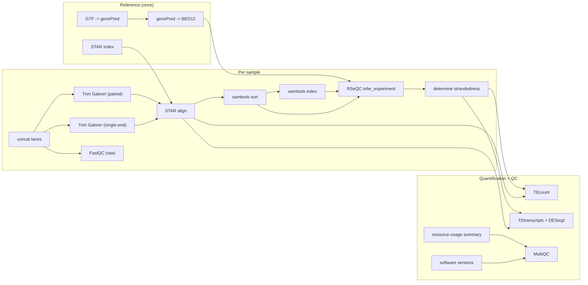

# rnaseq-star-tetranscripts


A Snakemake workflow that quantifies genes **and** transposable elements (TEs)
from RNA-seq data with [TEtranscripts/TEcount](https://github.com/mhammell-laboratory/TEtranscripts),
aligning with STAR and auto-detecting library strandedness via RSeQC.

<!-- flowchart:start -->

<!-- flowchart:end -->

## Pipeline at a glance

The workflow builds a STAR index and an RSeQC gene model (BED12) **once**, then
for every sample concatenates split lanes, optionally trims with TrimGalore!,
aligns with STAR, and auto-detects library strandedness from the sorted BAM.
TEcount quantifies genes + TEs per sample; if your sample sheet has a
`condition` column, TEtranscripts + DESeq2 also runs every pairwise contrast.
A single MultiQC report pulls together FastQC, TrimGalore!, STAR, RSeQC, tool
versions, and a per-rule resource-usage table.

## Table of contents

- [Quick start](#quick-start)
- [Configuration](#configuration)
- [Test profile](#test-profile)
- [Useful partial targets](#useful-partial-targets)
- [HPC / SLURM](#hpc--slurm)
- [Resuming & troubleshooting](#resuming--troubleshooting)
- [Resource usage & reports](#resource-usage--reports)
- [Tool versions](#tool-versions)
- [Without conda](#without-conda)
- [How strandedness is resolved](#how-strandedness-is-resolved)
- [Automatic differential analysis](#automatic-differential-analysis)
- [Output layout](#output-layout)
- [Notes](#notes)

## Quick start

There are two ways to get the environment the workflow needs. Both give you
the same `snakemake` plus every analysis tool — pick one:

- **Option A** (recommended): a pre-built environment tarball — no conda, no
  solver; needs only `bash`/`curl`/`tar`.
- **Option B**: build it yourself with conda (needs conda ≥23.10).

### Option A — pre-built environment (no conda)

Every GitHub release ships a tarball of the complete environment
(`...-env.tar.gz`, Linux x86_64), built from `workflow/environment.yaml` in CI —
so there is nothing to install or solve. Fetch and unpack it with the helper
script (needs only `bash`/`curl`/`tar`):

```bash
git clone https://github.com/altintasali/rnaseq-star-tetranscripts.git
cd rnaseq-star-tetranscripts
./workflow/scripts/install-env.sh   # downloads the latest release env into $HOME/software/rnaseq-star-tetranscripts-env
source workflow/scripts/activate-env.sh   # activates it in your current shell
```

Pass `-o PREFIX` to install elsewhere (e.g. shared cluster storage) and `-r vX.Y.Z`
to pin a specific release instead of the latest. If you used a custom `-o`,
activate it the same way: `source workflow/scripts/activate-env.sh /path/to/env`. Then
continue with the setup steps below.

Re-running `install-env.sh` replaces an existing install automatically (it
prints a warning); `-f` is only needed if the target directory holds unrelated
files. `activate-env.sh` prints a one-line confirmation on activation and
errors out with a reinstall hint if the environment looks incomplete.

### Option B — build it yourself with conda

Requires conda (e.g. [Miniforge](https://github.com/conda-forge/miniforge) or
Miniconda; conda ≥23.10 already uses the fast libmamba solver, so mamba is
optional).

```bash
git clone https://github.com/altintasali/rnaseq-star-tetranscripts.git
cd rnaseq-star-tetranscripts
conda env create -f workflow/environment.yaml   # snakemake + every analysis tool, installed once
conda activate rnaseq-star-tetranscripts
```

### Either way, then

```bash
# Verify the install (dry-run: parses the config, prints the plan, runs nothing):
snakemake --configfile config/test.yaml -n

# Smoke test on the bundled tiny synthetic dataset (no real genome/reads needed):
snakemake --configfile config/test.yaml --cores 4

# Set up your own analysis. input/config.yaml and input/samples.csv are
# gitignored on purpose, so every clone starts as a clean project and `git
# pull` never conflicts with your analysis settings -- create them from the
# committed .example templates:
cp config/config.example.yaml input/config.yaml
cp config/samples.example.csv input/samples.csv
# ...edit both (reference paths, sample sheet), then:
snakemake --cores 16
```

All tools (STAR, samtools, RSeQC, MultiQC, TEtranscripts, DESeq2, UCSC tools)
live directly in this environment, so no `--sdm conda` is needed — nothing to
download or solve per run. The pre-built tarball is exactly this environment,
pre-assembled from the same `workflow/environment.yaml`.

## Configuration

You only need two files to run an analysis, created from the committed
`.example` templates (both are gitignored, so each clone is a clean project):

```bash
cp config/config.example.yaml input/config.yaml
cp config/samples.example.csv input/samples.csv
```

**`input/config.yaml`** — reference paths and tool options (detailed comments
and examples live in `config/config.example.yaml`; this table is the quick
reference):

| key | meaning |
|-----|---------|
| `ref.fasta` | genome FASTA (Ensembl/GENCODE), user-supplied in `input/`. Plain or gzipped. |
| `ref.gtf` | gene annotation GTF, user-supplied in `input/`. Plain or gzipped. |
| `ref.te_gtf` | **curated** TE GTF from the TEtranscripts authors — a generic RepeatMasker GTF will *not* work (download link in `config/config.example.yaml`). Plain or gzipped. |
| `ref.sjdb_overhang` | `auto` (default) detects `max(read length) - 1` from your fastq files; set an integer to pin it. |
| `ref.decompressed_dir` | where gzipped references are decompressed to (default: `results/pipeline_info/ref_decompressed` — shared storage, `temp()`-cleaned once downstream rules finish). Keep off node-local `/tmp` on clusters — see Resuming & troubleshooting. |
| `star.index` | where the STAR index is built — **generated** under `results/`; an existing index is honored as-is and only rebuilt when missing (or `snakemake -R star_index`). |
| `star.extra` | alignment flags; pre-set to the TEtranscripts authors' multi-mapper recommendations. |
| `star.tmpdir` | STAR's per-run scratch dir (default: OS temp dir); set to big scratch on HPC. |
| `trimming.enabled` | run TrimGalore! before STAR (default `true`). `false` skips trimming — STAR reads merged/raw fastqs directly. While on, fastq names that already look trimmed (`*_trimmed*`, `*_val_[12]*`) are rejected at startup. |
| `trimming.trim_nextseq` | `--nextseq=N` for NextSeq/NovaSeq poly-G trimming; `0` (default) disables it. |
| `trimming.extra` | extra TrimGalore! flags passed verbatim. |
| `strandedness.min_fraction` | confidence threshold for RSeQC auto-detection. |
| `tetranscripts.*` | TEcount/TEtranscripts options (mode, padj, foldchange...). |
| `outputs.keep_merged_fastq` | keep the lane-concatenated fastqs (`results/fastq/`). `false` deletes them (temp()) once alignment is done. |
| `outputs.keep_trimmed_fastq` | keep the trimmed fastqs (`results/trimming/`). `false` deletes them (temp()) once alignment is done. |

**`input/samples.csv`** — the design file. Columns in this exact order
(an nf-core/rnaseq samplesheet works as-is):

| column | required? | meaning |
|--------|-----------|---------|
| `sample` | yes | sample name (no spaces). **Repeated rows with the same `sample` name mean that sample's reads are split across lanes/runs (nf-core style) — they're concatenated into one fastq per read before trimming/alignment.** |
| `fastq_1` | yes | read 1 / single-end fastq(.gz). |
| `fastq_2` | no | read 2 fastq(.gz); leave empty for single-end. Paired and single-end samples can be mixed. |
| `strandedness` | no | per-sample override: `auto`, `forward`, `reverse`, `unstranded`, or TEtranscripts' `no`. Blank = `auto`. |
| `condition` | no | biological group label. If present, TEtranscripts differential analysis runs automatically; if absent, it's skipped. |

All rows of a lane-split sample must agree on `strandedness` and `condition`,
and every row must include both `fastq_1` and `fastq_2` (single-end lanes
can't be mixed with paired-end lanes for the same sample). See
`config/samples.example.csv` for a worked example.

## Test profile

`config/test.yaml` runs the whole workflow end-to-end against a bundled
synthetic dataset in `.tests/` (50kb genome, 100 genes, one TE, 2 conditions
x 3 replicates): lane-split paired-end samples exercise the lane-merging
step, single-end samples exercise that branch too, and a DESeq2 contrast
mixes both library formats. Useful for confirming your setup or
smoke-testing rule edits:

```bash
snakemake --configfile config/test.yaml --cores 4 -n   # dry-run
snakemake --configfile config/test.yaml --cores 4      # run
```

## Useful partial targets

```bash
snakemake --cores 8 star_index_only      # just build the STAR index
snakemake --cores 8 strandedness_only    # align + auto-detect strandedness only
snakemake --cores 8 trimming_only        # merge lanes + TrimGalore! only (no alignment)
```

## HPC / SLURM

Rule-level threads/memory/runtime defaults live in
`workflow/default-config/resources.yaml`. Override any of them by creating
`input/resources.yaml` with just the keys you want to change (partial
overrides are deep-merged). Unlisted rules fall back to conservative defaults
(1 thread / 4 GB / 60 min).

To submit to SLURM, run snakemake with the bundled workflow profile (from the
repo root, like any snakemake invocation):

```bash
snakemake --workflow-profile workflow/profiles/slurm --configfile config/test.yaml   # smoke test on SLURM
snakemake --workflow-profile workflow/profiles/slurm --cores 64                     # limit total cores
snakemake --workflow-profile workflow/profiles/slurm -n                             # dry-run
```

The profile (`workflow/profiles/slurm/config.yaml`) submits every job with
`sbatch` and sizes each one from `input/resources.yaml`.
`slurm_account` in the profile is pre-set to the ICMM_DM group account; replace
it (and `qos`) with your cluster's values if you're not in that group.
`slurm_partition` is left unset on purpose, so sbatch uses the cluster's
default partition (if yours has none, add `slurm_partition`). Per-invocation
overrides are also possible, e.g.
`--set-resources star_align:mem_mb=64000`. Every tool runs from the shared
conda env, so make sure it's visible from the compute nodes — if nodes can't
read your home dir, install on shared storage
(`conda env create -p /shared/path/env`, or
`./workflow/scripts/install-env.sh -o /shared/software/rnaseq-star-tetranscripts-env`)
and put its `bin` directory on the nodes' `PATH`.

## Resuming & troubleshooting

- **Re-run after a failure:** just run the same command again — Snakemake
  skips jobs it already finished. Add `--rerun-incomplete` if the failed job
  may have left a partial output file behind.
- **Force a specific step:** `snakemake -R <rule>` re-runs a rule and its
  downstream (e.g. `-R star_index` to rebuild the index).
- **Where to look first:** per-rule stdout/stderr lives in
  `results/pipeline_info/logs/<rule>/...`; scheduler-level errors in
  `.snakemake/log/`. For a failed SLURM job, `sacct -j <jobid>` shows the
  node and exit code.
- **"output … missing locally, parent dir not present":** the job wrote to a
  node-local path (typically `/tmp`) the scheduler can't see from the
  submission node. Keep `ref.decompressed_dir` on shared storage (see the
  config table); a `/tmp` value is flagged with a warning at startup.
- **An input change isn't picked up:** rules with `ancient()` inputs (the
  STAR index) are only rebuilt when missing or via `-R`. The workflow warns
  at startup if the index was built for a different reference setup than the
  current config.
- **Multiple `--configfile`:** Snakemake keeps only the *last* one — they are
  not merged. Merge settings by editing `input/config.yaml`, or pass single
  overrides with `--config key=value`.

## Resource usage & reports

Every rule records its runtime and peak memory (threads/CPU-seconds) to
`results/pipeline_info/benchmarks/<rule>/...`. Three ways to use them:

- **Inside the MultiQC report.** Every run's `qc/multiqc_report.html` ends
  with a "Resource usage" section (aggregated from the benchmark files by the
  `benchmark_summary` rule) — a per-rule table of job count, mean/max wall
  time, and for both CPU and RAM: the allocated amount (`resources.yaml`),
  the mean/max actually used, and the efficiency (mean used / allocated).
  The quickest way to see which rules are the big hitters, how well you've
  sized their threads/memory, and where you can reclaim resources.

- **Per-rule cost tracking.** Each benchmark file is Snakemake's own short
  table (written by Snakemake >=8): `s, h:m:s, max_rss [MB], max_vms,
  max_uss, max_pss, io_in, io_out, mean_load [%], cpu_time`. A quick way to
  list them:

  ```bash
  ls results/pipeline_info/benchmarks/*/*
  ```

- **Full execution report.** Snakemake's own `--report` flag bundles the
  benchmark data plus the DAG, rules, and (with `--report --sdm conda`)
  environment details into a single HTML file — handy for sharing how a run
  consumed resources:

  ```bash
  ./workflow/scripts/benchmark-report.sh --configfile config/test.yaml   # -> report.html
  ./workflow/scripts/benchmark-report.sh -o out/report.html              # custom path
  snakemake --workflow-profile workflow/profiles/slurm --report report.html   # on SLURM
  ```

  `workflow/scripts/benchmark-report.sh` is a thin wrapper around
  `snakemake --report <out> "$@"` that passes everything else straight
  through. Because every rule declares `benchmark:`, the "Report" page lists
  peak CPU/memory per job; the `--report` HTML has a "Benchmarks" section
  with per-rule CPU/RSS charts.

> Note: `--report` re-evaluates the whole DAG including outputs, so the
> benchmark files must already exist from a finished run (that's what it
> aggregates). Run the workflow once, then `--report`.

## Tool versions

Every tool version is pinned independently with defaults shipped in
`workflow/default-config/versions.yaml` (STAR 2.7.11b, samtools 1.22.1,
TrimGalore! 0.6.10, FastQC 0.12.1, RSeQC 5.0.4, MultiQC 1.33, TEtranscripts
2.2.4, DESeq2 1.46.0, UCSC tools 482). Override any by creating
`input/versions.yaml` with just the keys you want to change:

```yaml
versions:
  star: "2.7.10b"
```

The tools are installed into the shared conda env
(`workflow/environment.yaml`) at env creation, with the same pins as
`versions.yaml` — keep the two files in sync when bumping a version, then
`conda env update -f workflow/environment.yaml` to apply. The pre-built
environment tarball on GitHub Releases is built from this same file in CI, so
it carries the identical pins. Two deliberate exceptions: `samtools` is pinned
to 1.22.1 because STAR 2.7.11b links `htslib <1.23`, incompatible with
samtools 1.23+ in one environment; and **TEtranscripts is pip-installed**
(`TEtranscripts==2.2.4`) because the bioconda recipe pins an ancient
`bioconductor-deseq` (DESeq v1) that can only coexist with R 4.0-era packages,
making it unsolvable alongside a modern DESeq2 (details in
`workflow/environment.yaml`). As a fallback, `--sdm conda` is still supported:
Snakemake then generates one small per-tool env per rule from `versions.yaml`
at parse time instead of using the shared env.

## Without conda

If STAR/samtools/TrimGalore!/FastQC/RSeQC/MultiQC/TEtranscripts are already
on your `PATH` (e.g. via `module load` on a cluster), just run `snakemake`
without the shared env activated — Snakemake runs the plain shell commands.
You then own the version matching; the shared conda env exists to guarantee
it automatically.

## How strandedness is resolved

1. Per-sample value from the `strandedness` column, if filled in; otherwise `auto`.
2. Only `auto` samples go through RSeQC (`samtools sort/index` -> GTF converted
   to BED12 -> `infer_experiment.py` -> `determine_strandedness.py`). The
   forward- or reverse-strand fraction must reach `strandedness.min_fraction`
   to call `forward`/`reverse`; otherwise the library is called `no`
   (unstranded).
3. For `tetranscripts_diffexp`, all samples in a contrast must resolve to the
   same strandedness value or the run fails with a clear error.

TEcount always receives raw, unsorted STAR output, per the TEtranscripts
authors' recommendation.

## Automatic differential analysis

If `samples.csv` has a `condition` column, the workflow builds one
TEtranscripts contrast for every pairwise combination of distinct condition
values, named `{later}_vs_{earlier}` alphabetically (e.g. `control`/`treatment`
-> `treatment_vs_control`). If the column is absent, the workflow stops after
per-sample TEcount quantification.

## Output layout

```
results/
├── fastq/{sample}_R{1,2}.fastq.gz                  # only for lane/run-split samples:
│                                                    #   concatenated lanes
├── fastqc/raw/{sample}_R{1,2}_fastqc.zip           # always-on FastQC of the raw input
├── trimming/                                       # only if trimming is enabled:
│   ├── {sample}_val_{1,2}.fq.gz                    #   trimmed reads (paired)
│   ├── {sample}_trimmed.fq.gz                      #   trimmed reads (single-end)
│   ├── {sample}_*_fastqc.html/.zip                 #   FastQC (run inside TrimGalore!)
│   └── {sample}_*_trimming_report.txt              #   TrimGalore! report
├── star_index/                                     # generated STAR genome index
├── reference/annotation.{genePred,bed12}           # generated RSeQC gene model (BED12)
├── star/{sample}_Aligned.out.bam                   # unsorted, fed to TEcount
├── star/{sample}_Aligned.sortedByCoord.out.bam(.bai)   # for RSeQC/QC
├── rseqc/{sample}_infer_experiment.txt             # raw RSeQC report
├── rseqc/{sample}_strandedness.txt                 # resolved no/forward/reverse
├── tecount/{sample}.cntTable                       # per-sample gene+TE counts
├── tetranscripts/{contrast}_*.{txt,R}              # only if "condition" column present
│                                                    #   ({contrast}.cntTable, _DESeq2.R,
│                                                    #   _gene_TE_analysis.txt, _sigdiff_gene_TE.txt)
├── versions/rnaseq_mqc_versions.yml                # pinned tool versions -> MultiQC
├── qc/multiqc_report.html                          # FastQC + STAR + RSeQC + resource usage
└── pipeline_info/
    ├── benchmarks/<rule>/...                       # per-rule CPU/RSS usage (-> MultiQC)
    ├── benchmark_summary_mqc.json                  # "Resource usage" table (see below)
    └── logs/<rule>/...                             # per-rule stdout/stderr
```

Everything under `input/` (your sample sheet, config, and reference fasta/GTF
files) is supplied by you; everything under `results/` (the index, gene model,
alignments, counts, report, benchmarks, and logs) is generated by the
workflow. Per-rule logs mirror the results layout under
`results/pipeline_info/logs/` (plus
`results/pipeline_info/logs/config_resolution.log`, which records how
`sjdb_overhang`, the decompressed-reference directory, and gzipped reference
files were resolved).

## Notes

- Versioning: the current release is recorded in the `VERSION` file at the repo
  root and tagged `vX.Y.Z` in git (the badge above tracks the latest tag).
- Gzipped fastqs are read natively by STAR, so merged/trimmed intermediates stay
  gzipped; gzipped references (`.fa.gz`/`.gtf.gz`) decompress once into
  `ref.decompressed_dir`. Mix and match freely.
- Already-trimmed-looking fastqs (`*_trimmed*`, `*_val_[12]*`) are rejected at
  startup while trimming is enabled — TrimGalore! would otherwise no-op-rename
  them to `*_trimmed_trimmed_trimmed.fq.gz` and break the pipeline.
- STAR index freshness: a prebuilt index is honored as-is even when the
  fasta/GTF it was built from is newer — rebuilt only when missing or via
  `snakemake -R star_index`. The workflow warns at startup if the index was
  built for a different reference setup.
- TEtranscripts/DESeq2 needs at least 2 replicates per group in a contrast.
- STAR indexing and TEtranscripts are memory-hungry (TEtranscripts: ~20-30 GB
  recommended for human data).
