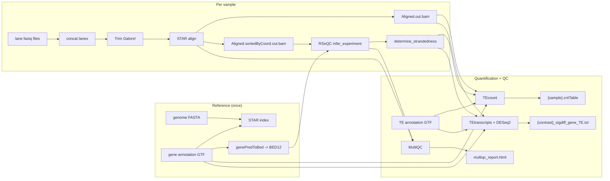

# rnaseq-star-tetranscripts


A Snakemake workflow that quantifies genes **and** transposable elements (TEs)
from RNA-seq data with [TEtranscripts/TEcount](https://github.com/mhammell-laboratory/TEtranscripts),
aligning with STAR and auto-detecting library strandedness via RSeQC.



## Quick start

There are two ways to get the environment the workflow needs. Pick one:

### Option A — pre-built environment (no conda)

Every GitHub release ships a tarball of the complete environment
(`...-env.tar.gz`, Linux x86_64), built from `workflow/environment.yaml` in CI —
so there is nothing to install or solve. Fetch and unpack it with the helper
script (needs only `bash`/`curl`/`tar`):

```bash
git clone https://github.com/altintasali/rnaseq-star-tetranscripts.git
cd rnaseq-star-tetranscripts
./workflow/scripts/install-env.sh   # downloads the latest release env into $HOME/software/rnaseq-star-tetranscripts-env
source workflow/scripts/activate-env.sh   # activates it in your current shell
```

Pass `-o PREFIX` to install elsewhere (e.g. shared cluster storage) and `-r vX.Y.Z`
to pin a specific release instead of the latest. If you used a custom `-o`,
activate it the same way: `source workflow/scripts/activate-env.sh /path/to/env`. Then
continue with the setup steps below.

Re-running `install-env.sh` replaces an existing install automatically (it
prints a warning); `-f` is only needed if the target directory holds unrelated
files. `activate-env.sh` prints a one-line confirmation on activation and
errors out with a reinstall hint if the environment looks incomplete.

### Option B — build it yourself with conda

Requires conda (e.g. [Miniforge](https://github.com/conda-forge/miniforge) or
Miniconda; conda ≥23.10 already uses the fast libmamba solver, so mamba is
optional).

```bash
git clone https://github.com/altintasali/rnaseq-star-tetranscripts.git
cd rnaseq-star-tetranscripts
conda env create -f workflow/environment.yaml   # snakemake + every analysis tool, installed once
conda activate rnaseq-star-tetranscripts
```

### Either way, then

```bash
# Smoke test on the bundled tiny synthetic dataset (no real genome/reads needed):
snakemake --configfile config/test.yaml --cores 4

# Set up your own analysis. input/config.yaml and input/samples.csv are
# gitignored on purpose, so every clone starts as a clean project and `git
# pull` never conflicts with your analysis settings -- create them from the
# committed .example templates:
cp config/config.example.yaml input/config.yaml
cp config/samples.example.csv input/samples.csv
# ...edit both (reference paths, sample sheet), then:
snakemake --cores 16
```

All tools (STAR, samtools, RSeQC, MultiQC, TEtranscripts, DESeq2, UCSC tools)
live directly in this environment, so no `--sdm conda` is needed — nothing to
download or solve per run. The pre-built tarball is exactly this environment,
pre-assembled from the same `workflow/environment.yaml`.

## Configuration

You only need two files to run an analysis, created from the committed
`.example` templates (both are gitignored, so each clone is a clean project):

```bash
cp config/config.example.yaml input/config.yaml
cp config/samples.example.csv input/samples.csv
```

**`input/config.yaml`** — reference paths and tool options:

| key | meaning |
|-----|---------|
| `ref.fasta` | genome FASTA (Ensembl/GENCODE), user-supplied in `input/`. Plain or gzipped. |
| `ref.gtf` | gene annotation GTF, user-supplied in `input/`. Plain or gzipped. |
| `ref.te_gtf` | **curated** TE GTF from the TEtranscripts authors (download the file matching your genome build from [mghlab.org/software/tetranscripts](https://www.mghlab.org/software/tetranscripts) — a generic RepeatMasker GTF will *not* work), user-supplied in `input/`. Plain or gzipped. |
| `ref.sjdb_overhang` | `auto` (default) detects `max(read length) - 1` from your fastq files; set an integer to pin it. |
| `ref.decompressed_dir` | where gzipped references are decompressed to (default: a directory under `/tmp` — ephemeral, but cheap to rebuild). |
| `star.index` | where to (re)build the STAR index — **generated** by the workflow under `results/`, not user-supplied. An existing index is honored as-is; it's only rebuilt when missing (or via `snakemake -R star_index`). |
| `star.extra` | alignment flags; pre-set to the TEtranscripts authors' multi-mapper recommendations. |
| `star.tmpdir` | directory for STAR's per-run scratch files (its `_STARtmp` dir, ~a BAM's worth of data). Defaults to the OS temp dir; set to a big scratch filesystem on HPC if node-local `/tmp` is small. |
| `trimming.enabled` | run TrimGalore! adapter/quality trimming before STAR (default `true`, nf-core/rnaseq-style). `false` skips trimming entirely — STAR reads the merged/raw fastqs directly, and the MultiQC report keeps the raw-input FastQC section but drops the trimming/trimmed-FastQC ones. |
| `trimming.trim_nextseq` | `--nextseq=N` for NextSeq/NovaSeq poly-G trimming; `0` (default) disables it. |
| `trimming.extra` | extra TrimGalore! flags passed verbatim. |
| `strandedness.min_fraction` | confidence threshold for RSeQC auto-detection. |
| `tetranscripts.*` | TEcount/TEtranscripts options (mode, padj, foldchange...). |
| `outputs.keep_merged_fastq` | keep the lane-concatenated fastqs (`results/fastq/`). `false` deletes them (temp()) once alignment is done. |
| `outputs.keep_trimmed_fastq` | keep the trimmed fastqs (`results/trimming/`). `false` deletes them (temp()) once alignment is done. |

**`input/samples.csv`** — the design file. Columns in this exact order
(an nf-core/rnaseq samplesheet works as-is):

| column | required? | meaning |
|--------|-----------|---------|
| `sample` | yes | sample name (no spaces). **Repeated rows with the same `sample` name mean that sample's reads are split across lanes/runs (nf-core style) — they're concatenated into one fastq per read before trimming/alignment.** |
| `fastq_1` | yes | read 1 / single-end fastq(.gz). |
| `fastq_2` | no | read 2 fastq(.gz); leave empty for single-end. Paired and single-end samples can be mixed. |
| `strandedness` | no | per-sample override: `auto`, `forward`, `reverse`, `unstranded`, or TEtranscripts' `no`. Blank = `auto`. |
| `condition` | no | biological group label. If present, TEtranscripts differential analysis runs automatically; if absent, it's skipped. |

All rows of a lane-split sample must agree on `strandedness` and `condition`,
and every row must include both `fastq_1` and `fastq_2` (single-end lanes
can't be mixed with paired-end lanes for the same sample). See
`config/samples.example.csv` for a worked example.

## Test profile

`config/test.yaml` runs the whole workflow end-to-end against a bundled
synthetic dataset in `.tests/` (50kb genome, 100 genes, one TE, 2 conditions
x 3 replicates). The first two replicates of each condition are paired-end
(`treatment_rep1` deliberately split across two lanes to exercise the
lane-merging step); the third replicates (`control_rep3`, `treatment_rep3`)
are single-end. The single-end samples deliberately sit in the same two
conditions as the paired-end samples so the test run exercises the
workflow's per-sample single/paired-end branching -- trimming (trim_galore_pe
vs trim_galore_se), STAR --readFilesIn, RSeQC strandedness auto-detection
(which supports single-end BAMs), TEcount, and a DESeq2 contrast that mixes
both library formats. Useful for confirming your setup or smoke-testing
rule edits:

```bash
snakemake --configfile config/test.yaml --cores 4 -n   # dry-run
snakemake --configfile config/test.yaml --cores 4      # run
```

## Useful partial targets

```bash
snakemake --cores 8 star_index_only      # just build the STAR index
snakemake --cores 8 strandedness_only    # align + auto-detect strandedness only
snakemake --cores 8 trimming_only        # merge lanes + TrimGalore! only (no alignment)
```

## HPC / SLURM

Rule-level threads/memory/runtime defaults live in
`workflow/default-config/resources.yaml`. Override any of them by creating
`input/resources.yaml` with just the keys you want to change (partial
overrides are deep-merged). Unlisted rules fall back to conservative defaults
(1 thread / 4 GB / 60 min).

To submit to SLURM:

```bash
./workflow/scripts/run_slurm.sh                # snakemake --workflow-profile workflow/profiles/slurm
./workflow/scripts/run_slurm.sh --configfile config/test.yaml   # smoke test on SLURM
```

`workflow/scripts/run_slurm.sh` is a thin wrapper that runs snakemake with the
SLURM profile (`workflow/profiles/slurm/config.yaml`) from the repo root and
passes any extra arguments straight through (so `-n` dry-runs, `--cores`, `-R`
etc. all work). Under the hood it's just:

```bash
snakemake --workflow-profile workflow/profiles/slurm
```

`slurm_account` in `workflow/profiles/slurm/config.yaml` is pre-set to the
ICMM_DM group account; replace it (and `qos`) with your cluster's values if
you're not in that group. `slurm_partition` is left unset on purpose, so
sbatch uses the cluster's default partition (if yours has none, add
`slurm_partition`). Per-invocation overrides are also possible, e.g.
`--set-resources star_align:mem_mb=64000`. Every tool runs from the shared
conda env, so make sure it's visible from the compute nodes (conda envs are
self-contained; if nodes can't read your home dir, install it on shared
storage with `conda env create -p /shared/path/env` and adjust your `PATH`).
The pre-built environment is the quickest way to do this: extract it once on
shared storage (e.g. `./workflow/scripts/install-env.sh -o /shared/software/rnaseq-star-tetranscripts-env`)
and either add its `bin` directory to your `PATH` on the nodes or `source
/shared/software/rnaseq-star-tetranscripts-env/bin/activate` inside each job
wrapper — no conda or container runtime needed.

## Resource usage & reports

Every rule records its runtime and peak memory (threads/CPU-seconds) to
`results/pipeline_info/benchmarks/<rule>/...`. Three ways to use them:

- **Inside the MultiQC report.** Every run's `qc/multiqc_report.html` ends
  with a "Resource usage" section (aggregated from the benchmark files by the
  `benchmark_summary` rule) — a per-rule table of job count, mean/max wall
  time, mean/max peak RSS, and mean CPU load. The quickest way to see which
  rules are the big hitters and how to size your cluster resources.

- **Per-rule cost tracking.** Each benchmark file is a short table of
  `s, cpu_percent, max_rss, ...`. A quick way to list them:

  ```bash
  ls results/pipeline_info/benchmarks/*/*
  ```

- **Full execution report.** Snakemake's own `--report` flag bundles the
  benchmark data plus the DAG, rules, and (with `--report --sdm conda`)
  environment details into a single HTML file — handy for sharing how a run
  consumed resources:

  ```bash
  ./workflow/scripts/benchmark-report.sh --configfile config/test.yaml   # -> report.html
  ./workflow/scripts/benchmark-report.sh -o out/report.html              # custom path
  ./workflow/scripts/run_slurm.sh --report report.html                   # on SLURM
  ```

  `workflow/scripts/benchmark-report.sh` is a thin wrapper around
  `snakemake --report <out> "$@"` that passes everything else straight
  through. Because every rule declares `benchmark:`, the "Report" page lists
  peak CPU/memory per job; the `--report` HTML has a "Benchmarks" section
  with per-rule CPU/RSS charts.

> Note: `--report` re-evaluates the whole DAG including outputs, so the
> benchmark files must already exist from a finished run (that's what it
> aggregates). Run the workflow once, then `--report`.

## Tool versions

Every tool version is pinned independently with defaults shipped in
`workflow/default-config/versions.yaml` (STAR 2.7.11b, samtools 1.22.1,
TrimGalore! 0.6.10, FastQC 0.12.1, RSeQC 5.0.4, MultiQC 1.33, TEtranscripts
2.2.4, DESeq2 1.46.0, UCSC tools 482).
Override any by creating `input/versions.yaml` with just the keys you want to
change:

```yaml
versions:
  star: "2.7.10b"
```

The tools are installed into the shared conda env
(`workflow/environment.yaml`) at env creation, with the same pins as
`versions.yaml` — keep the two files in sync when bumping a version, then
`conda env update -f workflow/environment.yaml` to apply. The pre-built
environment tarball on GitHub Releases (see Quick start) is built from this
same `workflow/environment.yaml`, so it carries the identical pins — it's a
convenience artifact built in CI, not a fork of the version list.
`samtools` is pinned to 1.22.1 rather than newer: STAR 2.7.11b (the final STAR
release) links against `htslib <1.23`, which is incompatible with samtools
1.23+ in a single environment.

As a fallback, `--sdm conda` is still supported: Snakemake then generates one
small per-tool env per rule from `versions.yaml` at parse time instead of using
the shared env. This workflow does not use snakemake-wrappers, since a wrapper
tag pins all its tools' versions together.

One exception to the conda scheme: **TEtranscripts is installed from PyPI**
(`TEtranscripts==2.2.4`), not bioconda. The bioconda recipe's runtime deps pin
an ancient `bioconductor-deseq` (DESeq v1) that can only coexist with R 4.0-era
packages, making the conda package unsolvable alongside a modern DESeq2/R on
any platform. TEtranscripts only uses DESeq2 at runtime, so the environment
conda-installs `deseq2`/`r_base` (pins still apply) and pip-installs the
pure-Python TEtranscripts package.

## Without conda

If STAR/samtools/TrimGalore!/FastQC/RSeQC/MultiQC/TEtranscripts are already
on your `PATH` (e.g. via `module load` on a cluster), just run `snakemake`
without the shared env activated — Snakemake runs the plain shell commands.
You then own the version matching; the shared conda env exists to guarantee
it automatically.

## How strandedness is resolved

1. Per-sample value from the `strandedness` column, if filled in; otherwise `auto`.
2. Only `auto` samples go through RSeQC (`samtools sort/index` -> GTF converted
   to BED12 -> `infer_experiment.py` -> `determine_strandedness.py`). The
   forward- or reverse-strand fraction must reach `strandedness.min_fraction`
   to call `forward`/`reverse`; otherwise the library is called `no`
   (unstranded).
3. For `tetranscripts_diffexp`, all samples in a contrast must resolve to the
   same strandedness value or the run fails with a clear error.

TEcount always receives raw, unsorted STAR output, per the TEtranscripts
authors' recommendation.

## Automatic differential analysis

If `samples.csv` has a `condition` column, the workflow builds one
TEtranscripts contrast for every pairwise combination of distinct condition
values, named `{later}_vs_{earlier}` alphabetically (e.g. `control`/`treatment`
-> `treatment_vs_control`). If the column is absent, the workflow stops after
per-sample TEcount quantification.

## Output layout

```
results/
├── fastq/{sample}_R{1,2}.fastq.gz                  # only for lane/run-split samples:
│                                                    #   concatenated lanes
├── fastqc/raw/{sample}_R{1,2}_fastqc.zip           # always-on FastQC of the raw input
├── trimming/                                       # only if trimming is enabled:
│   ├── {sample}_val_{1,2}.fq.gz                    #   trimmed reads (paired)
│   ├── {sample}_trimmed.fq.gz                      #   trimmed reads (single-end)
│   ├── {sample}_*_fastqc.html/.zip                 #   FastQC (run inside TrimGalore!)
│   └── {sample}_*_trimming_report.txt              #   TrimGalore! report
├── star_index/                                     # generated STAR genome index
├── reference/annotation.{genePred,bed12}           # generated RSeQC gene model (BED12)
├── star/{sample}_Aligned.out.bam                   # unsorted, fed to TEcount
├── star/{sample}_Aligned.sortedByCoord.out.bam(.bai)   # for RSeQC/QC
├── rseqc/{sample}_infer_experiment.txt             # raw RSeQC report
├── rseqc/{sample}_strandedness.txt                 # resolved no/forward/reverse
├── tecount/{sample}.cntTable                       # per-sample gene+TE counts
├── tetranscripts/{contrast}_*.{txt,R}              # only if "condition" column present
│                                                    #   ({contrast}.cntTable, _DESeq2.R,
│                                                    #   _gene_TE_analysis.txt, _sigdiff_gene_TE.txt)
├── versions/rnaseq_mqc_versions.yml                # pinned tool versions -> MultiQC
├── qc/multiqc_report.html                          # FastQC + STAR + RSeQC + resource usage
└── pipeline_info/
    ├── benchmarks/<rule>/...                       # per-rule CPU/RSS usage (-> MultiQC)
    ├── benchmark_summary_mqc.json                  # "Resource usage" table (see below)
    └── logs/<rule>/...                             # per-rule stdout/stderr
```

Everything under `input/` (your sample sheet, config, and reference fasta/GTF
files) is supplied by you; everything under `results/` (the index, gene model,
alignments, counts, report, benchmarks, and logs) is generated by the
workflow. Per-rule logs mirror the results layout under
`results/pipeline_info/logs/` (plus
`results/pipeline_info/logs/config_resolution.log`, which records how
`sjdb_overhang`, the decompressed-reference directory, and gzipped reference
files were resolved).

## Notes

- Versioning: the current release is recorded in the `VERSION` file at the repo
  root and tagged `vX.Y.Z` in git (the badge above tracks the latest tag).
- Gzipped reference files (`.fa.gz` / `.gtf.gz`) are decompressed automatically
  into `ref.decompressed_dir` (default: a directory under `/tmp` — ephemeral,
  but cheap to rebuild); gzipped fastq files are read natively by STAR, so the
  merged/trimmed intermediates stay gzipped throughout. Mix and match freely.
- Lane/run merging and trimming: repeated `sample` rows in the sample sheet are
  concatenated into `results/fastq/` before (optional, on by default)
  TrimGalore! trimming in `results/trimming/`. Setting `trimming.enabled: false`
  skips trimming entirely and STAR reads the merged/raw fastqs directly.
- Intermediate fastq cleanup: by default the merged and trimmed fastqs are
  kept. Set `outputs.keep_merged_fastq` / `outputs.keep_trimmed_fastq` to
  `false` and Snakemake deletes them (temp()) once alignment is done — they
  are then regenerated on the next run, so the FastQC reports (which MultiQC
  reads) are unaffected. `keep_merged_fastq: false` only makes sense while
  trimming is enabled, otherwise STAR consumes the merged fastqs directly and
  deleting them forces a full re-alignment on the next run.
- STAR's scratch directory (its `_STARtmp`, ~a BAM's worth of per-thread
  chunks) is written to `star.tmpdir` (default: the OS temp dir) instead of
  the results tree, and removed after each alignment — even if STAR crashes
  before its own cleanup.
- The MultiQC report includes a "Software Versions" section (and tags the
  STAR/FastQC/... general-stats rows with versions) from the pinned
  `config["versions"]`, written by the `software_versions` rule to
  `results/versions/rnaseq_mqc_versions.yml`.
- STAR index freshness: a prebuilt/reused index directory is honored as-is even
  when the fasta/GTF it was built from is newer — the index is only rebuilt when
  missing, or explicitly with `snakemake -R star_index`. (Snakemake otherwise
  compares mtimes and would rebuild a shared index every run.)
- TEtranscripts/DESeq2 needs at least 2 replicates per group in a contrast.
- STAR indexing and TEtranscripts are memory-hungry (TEtranscripts: ~20-30 GB
  recommended for human data).
