# TEtranscripts-pipe


A Snakemake workflow that quantifies genes **and** transposable elements (TEs)
from RNA-seq data with [TEtranscripts/TEcount](https://github.com/mhammell-laboratory/TEtranscripts),
aligning with STAR and auto-detecting library strandedness via RSeQC.

```mermaid
flowchart LR
    subgraph reference_once["Reference (once)"]
        star_index["STAR index"]
        gtf_to_genepred["GTF -> genePred"]
        genepred_to_bed12["genePred -> BED12"]
        telocal_locind["TElocal locus index"]
        cleanup_star_index["remove STAR index (if keep: false)"]
    end
    subgraph per_sample["Per sample"]
        cat_fastq["concat lanes"]
        trim_galore_pe["Trim Galore! (paired)"]
        trim_galore_se["Trim Galore! (single-end)"]
        star_align["STAR align"]
        samtools_sort["samtools sort"]
        samtools_index["samtools index"]
        fastqc_raw["FastQC (raw)"]
        rseqc_infer_experiment["RSeQC infer_experiment"]
        determine_strandedness["determine strandedness"]
    end
    subgraph quantification_qc["Quantification + QC"]
        tecount["TEcount"]
        tetranscripts_diffexp["TEtranscripts + DESeq2"]
        tecount_counts["tecount counts matrix"]
        tecount_qc_transform["sample-QC transform (vst/rlog/log2)"]
        tecount_qc["sample-QC plots (PCA + clustering)"]
        tecount_summary["tecount summary barplots (assignment + TE class)"]
        telocal["TElocal"]
        telocal_counts["telocal counts matrix"]
        telocal_qc_transform["telocal sample-QC transform (log2/vst/rlog)"]
        telocal_qc["telocal sample-QC plots (PCA + clustering)"]
        telocal_summary["telocal summary barplots (assignment + TE class)"]
        cleanup_telocal_index["remove TElocal index (if keep: false)"]
        software_versions["software versions"]
        config_used["config used"]
        benchmark_summary["resource-usage summary"]
        multiqc["MultiQC"]
    end
    subgraph chimera_screen["Chimera screen"]
        annotation_to_bed["annotation -> BED tracks"]
        parse_chimeric_junctions["parse chimeric junctions"]
        chimera_telocal_annotate["annotate junctions with TElocal counts"]
        junction_qc["junction QC"]
        junction_qc_barplot["junction QC barplot"]
        chimera_igv_bed["IGV BED track"]
        chimera_counts["chimera counts matrix"]
        sample_qc_transform["sample-QC transform"]
        sample_qc["sample-QC plots"]
    end
    subgraph other["Other"]
        chimera_telocal_index["chimera_telocal_index"]
        rseqc_gene_body_coverage["rseqc_gene_body_coverage"]
        rseqc_read_distribution["rseqc_read_distribution"]
        samtools_flagstat["samtools_flagstat"]
        star_align_pass1["star_align_pass1"]
        star_merge_junctions["star_merge_junctions"]
        telocal_locations["telocal_locations"]
    end
    annotation_to_bed --> parse_chimeric_junctions
    benchmark_summary --> multiqc
    cat_fastq --> fastqc_raw
    cat_fastq --> trim_galore_pe
    cat_fastq --> trim_galore_se
    chimera_counts --> sample_qc_transform
    chimera_telocal_annotate --> chimera_counts
    chimera_telocal_index --> chimera_telocal_annotate
    determine_strandedness --> parse_chimeric_junctions
    determine_strandedness --> tecount
    determine_strandedness --> telocal
    determine_strandedness --> tetranscripts_diffexp
    genepred_to_bed12 --> rseqc_gene_body_coverage
    genepred_to_bed12 --> rseqc_infer_experiment
    genepred_to_bed12 --> rseqc_read_distribution
    gtf_to_genepred --> genepred_to_bed12
    junction_qc --> junction_qc_barplot
    parse_chimeric_junctions --> chimera_igv_bed
    parse_chimeric_junctions --> chimera_telocal_annotate
    parse_chimeric_junctions --> junction_qc
    rseqc_infer_experiment --> determine_strandedness
    sample_qc_transform --> sample_qc
    samtools_index --> rseqc_gene_body_coverage
    samtools_index --> rseqc_infer_experiment
    samtools_index --> rseqc_read_distribution
    samtools_index --> samtools_flagstat
    samtools_sort --> rseqc_gene_body_coverage
    samtools_sort --> rseqc_infer_experiment
    samtools_sort --> rseqc_read_distribution
    samtools_sort --> samtools_flagstat
    samtools_sort --> samtools_index
    software_versions --> multiqc
    star_align --> cleanup_star_index
    star_align --> parse_chimeric_junctions
    star_align --> samtools_sort
    star_align --> tecount
    star_align --> telocal
    star_align --> tetranscripts_diffexp
    star_align_pass1 --> star_merge_junctions
    star_index --> star_align
    star_index --> star_align_pass1
    star_merge_junctions --> star_align
    tecount --> tecount_counts
    tecount --> tecount_summary
    tecount_counts --> tecount_qc_transform
    tecount_qc_transform --> tecount_qc
    telocal --> chimera_telocal_index
    telocal --> cleanup_telocal_index
    telocal --> telocal_counts
    telocal --> telocal_summary
    telocal_counts --> telocal_qc_transform
    telocal_locind --> telocal
    telocal_qc_transform --> telocal_qc
    trim_galore_pe --> star_align
    trim_galore_pe --> star_align_pass1
    trim_galore_se --> star_align
    trim_galore_se --> star_align_pass1
```

<!-- flowchart:start -->

<!-- flowchart:end -->

## Pipeline at a glance

The workflow builds a STAR index and an RSeQC gene model (BED12) **once**, then
for every sample concatenates split lanes, optionally trims with TrimGalore!,
aligns with STAR, and auto-detects library strandedness from the sorted BAM.
TEcount quantifies genes + TEs per sample (subfamily-level); TElocal provides
locus-level TE quantification from the same alignment. If your sample sheet has
a `condition` column, TEtranscripts + DESeq2 also runs every pairwise contrast.
The per-sample TEcount tables also drive a sample-QC view (PCA + sample
clustering, on by default) and per-sample summary barplots (gene-vs-TE
assignment and TE class composition), rendered inside the MultiQC report;
the TElocal tables drive the same section set for the locus-level counts.
The **same** alignment also drives a gene-TE chimera
screen that annotates chimeric junction reads and produces a counts matrix,
an interactive sample-QC view, and a junction-QC barplot (on by default;
set `chimera.junction.enabled: false` to opt out). A single MultiQC
report pulls together
FastQC, TrimGalore!, STAR, RSeQC, the TEcounts, TElocal, and chimera QC plots, tool
versions, and a per-rule resource-usage table.

## Documentation

This README covers getting the pipeline installed and running. Everything
else — every config key, the CLI, HPC/SLURM setup, and how each stage
(strandedness, STAR 2-pass, TEcounts/TElocal sample-QC, the two chimera
screens) actually works — lives in the
**[wiki](https://github.com/altintasali/TEtranscripts-pipe/wiki)**:

- **Configuration & running**: [Configuration Reference](https://github.com/altintasali/TEtranscripts-pipe/wiki/Configuration-Reference) · [Command-Line Interface](https://github.com/altintasali/TEtranscripts-pipe/wiki/Command-Line-Interface) · [Running the Pipeline](https://github.com/altintasali/TEtranscripts-pipe/wiki/Running-the-Pipeline) · [HPC and SLURM](https://github.com/altintasali/TEtranscripts-pipe/wiki/HPC-and-SLURM) · [Resource Usage and Reports](https://github.com/altintasali/TEtranscripts-pipe/wiki/Resource-Usage-and-Reports) · [Tool Versions](https://github.com/altintasali/TEtranscripts-pipe/wiki/Tool-Versions)
- **How each stage works**: [Strandedness and STAR 2-pass](https://github.com/altintasali/TEtranscripts-pipe/wiki/Strandedness-and-STAR-2-pass) · [Automatic Differential Analysis](https://github.com/altintasali/TEtranscripts-pipe/wiki/Automatic-Differential-Analysis) · [TEcounts Sample-QC](https://github.com/altintasali/TEtranscripts-pipe/wiki/TEcounts-Sample-QC) · [TElocal](https://github.com/altintasali/TEtranscripts-pipe/wiki/TElocal) · [Chimera Detection](https://github.com/altintasali/TEtranscripts-pipe/wiki/Chimera-Detection)
- **Reference**: [Output Layout](https://github.com/altintasali/TEtranscripts-pipe/wiki/Output-Layout)

## Quick start

There are two ways to get the environment the workflow needs. Both give you
the same `snakemake` plus every analysis tool — pick one:

- **Option A** (recommended): a pre-built environment tarball — no conda, no
  solver; needs only `bash`/`curl`/`tar`.
- **Option B**: build it yourself with conda (needs conda ≥23.10).

### Option A — pre-built environment (no conda)

Every GitHub release ships a tarball of the complete environment
(`...-env.tar.gz`, Linux x86_64), built from `workflow/environment.yaml` in CI —
so there is nothing to install or solve. Fetch and unpack it with the helper
script (needs only `bash`/`curl`/`tar`):

```bash
git clone https://github.com/altintasali/TEtranscripts-pipe.git
cd TEtranscripts-pipe
./workflow/scripts/install-env.sh   # downloads the latest release env into $HOME/software/tetranscripts-pipe-env
source workflow/scripts/activate-env.sh   # activates it in your current shell
```

Pass `-o PREFIX` to install elsewhere (e.g. shared cluster storage) and `-r vX.Y.Z`
to pin a specific release instead of the latest. If you used a custom `-o`,
activate it the same way: `source workflow/scripts/activate-env.sh /path/to/env`. Then
continue with the setup steps below.

Re-running `install-env.sh` replaces an existing install automatically (it
prints a warning); `-f` is only needed if the target directory holds unrelated
files. `activate-env.sh` prints a one-line confirmation on activation and
errors out with a reinstall hint if the environment looks incomplete.

### Option B — build it yourself with conda

Requires conda (e.g. [Miniforge](https://github.com/conda-forge/miniforge) or
Miniconda; conda ≥23.10 already uses the fast libmamba solver, so mamba is
optional).

```bash
git clone https://github.com/altintasali/TEtranscripts-pipe.git
cd TEtranscripts-pipe
conda env create -f workflow/environment.yaml   # snakemake + every analysis tool, installed once
conda activate tetranscripts-pipe
```

### Either way, then

```bash
# Verify the install (dry-run: parses the config, prints the plan, runs nothing):
snakemake --configfile config/test.yaml -n

# Smoke test on the bundled tiny synthetic dataset (no real genome/reads needed):
snakemake --configfile config/test.yaml --cores 4

# Set up your own analysis. input/config.yaml and input/samples.csv are
# gitignored on purpose, so every clone starts as a clean project and `git
# pull` never conflicts with your analysis settings -- create them from the
# committed .example templates:
cp config/config.example.yaml input/config.yaml
cp config/samples.example.csv input/samples.csv
# ...edit both (reference paths, sample sheet), then:
snakemake --cores 16
```

(Or let the bundled CLI do these setup steps for you — `init`, `samples`, and
`run` generate the same files and launch snakemake; see the wiki's
[Command-Line Interface](https://github.com/altintasali/TEtranscripts-pipe/wiki/Command-Line-Interface) page.)

All tools (STAR, samtools, RSeQC, MultiQC, TEtranscripts, DESeq2, pheatmap,
UCSC tools) live directly in this environment, so no `--sdm conda` is needed —
nothing to download or solve per run. The pre-built tarball is exactly this
environment, pre-assembled from the same `workflow/environment.yaml`.

## Configuration

You only need two files to run an analysis, created from the committed
`.example` templates (both are gitignored, so each clone is a clean project):

```bash
cp config/config.example.yaml input/config.yaml
cp config/samples.example.csv input/samples.csv
```

`input/config.yaml` holds reference paths and tool options (every key is
documented with comments and examples right there); `input/samples.csv` is
the design file (`sample`, `fastq_1`, `fastq_2`, `strandedness`, `condition`
columns — an nf-core/rnaseq samplesheet works as-is). For the full key-by-key
reference for both files, see the wiki's
[Configuration Reference](https://github.com/altintasali/TEtranscripts-pipe/wiki/Configuration-Reference).

## Notes

- Versioning: the current release is recorded in the `VERSION` file at the repo
  root and tagged `vX.Y.Z` in git (the version badge above shows the current
  release).
- Gzipped fastqs are read natively by STAR, so merged/trimmed intermediates stay
  gzipped; gzipped references (`.fa.gz`/`.gtf.gz`) decompress once automatically.
  Mix and match freely.
- TEtranscripts/DESeq2 needs at least 2 replicates per group in a contrast.
- STAR indexing and TEtranscripts are memory-hungry (TEtranscripts: ~20-30 GB
  recommended for human data).

See the [wiki](https://github.com/altintasali/TEtranscripts-pipe/wiki) for
everything else, including troubleshooting startup errors and resuming a
failed run.
