# Full Pipeline Flowchart

Auto-generated from `snakemake --rulegraph` by `workflow/scripts/flowchart.py` -- do not hand-edit (regenerate instead, see the script's docstring). One node per rule; for a simpler, conceptual diagram see the main [README](https://github.com/altintasali/TEtranscripts-pipe#readme).

```mermaid
flowchart LR
    subgraph reference_once["Reference (once)"]
        star_index["STAR index"]
        gtf_to_genepred["GTF -> genePred"]
        genepred_to_bed12["genePred -> BED12"]
        telocal_locind["TElocal locus index"]
        telocal_locations["TElocal locations"]
        cleanup_star_index["remove STAR index (if keep: false)"]
        gene_name_lookup["gene_id -> gene_name lookup"]
    end
    subgraph per_sample["Per sample"]
        cat_fastq["concat lanes"]
        trim_galore_pe["Trim Galore! (paired)"]
        trim_galore_se["Trim Galore! (single-end)"]
        star_align["STAR align"]
        samtools_sort["samtools sort"]
        samtools_index["samtools index"]
        fastqc_raw["FastQC (raw)"]
        star_align_pass1["STAR pass 1 (2-pass)"]
        star_merge_junctions["merge splice junctions"]
        samtools_flagstat["samtools flagstat"]
        rseqc_infer_experiment["RSeQC infer_experiment"]
        rseqc_read_distribution["RSeQC read distribution"]
        rseqc_gene_body_coverage["RSeQC gene body coverage"]
        determine_strandedness["determine strandedness"]
    end
    subgraph quantification_qc["Quantification + QC"]
        tecount["TEcount"]
        tetranscripts_diffexp["TEtranscripts + DESeq2"]
        tecount_counts["tecount counts matrix"]
        tecount_qc_transform["sample-QC transform (vst/rlog/log2)"]
        tecount_qc["sample-QC plots (PCA + clustering)"]
        tecount_summary["tecount summary barplots (assignment + TE class)"]
        telocal["TElocal"]
        telocal_counts["telocal counts matrix"]
        telocal_qc_transform["telocal sample-QC transform (log2/vst/rlog)"]
        telocal_qc["telocal sample-QC plots (PCA + clustering)"]
        telocal_summary["telocal summary barplots (assignment + TE class)"]
        cleanup_telocal_index["remove TElocal index (if keep: false)"]
        software_versions["software versions"]
        config_used["config used"]
        evidence_overview["evidence overview ('start here')"]
        strandedness_check["strandedness check (declared vs inferred)"]
        benchmark_summary["resource-usage summary"]
        multiqc["MultiQC"]
    end
    subgraph chimera_screen["Chimera screen"]
        annotation_to_bed["annotation -> BED tracks"]
        chimera_reads_classify["classify chimeric junctions"]
        chimera_telocal_annotate["annotate junctions with TElocal counts"]
        chimera_reads_qc["junction QC"]
        chimera_reads_qc_barplot["junction QC barplot"]
        chimera_reads_highlights["read-screen notes (blind spot + counts)"]
        chimera_evidence["unified gene-TE evidence catalogue"]
        chimera_evidence_heatmap["evidence correlation + candidate heatmaps"]
        chimera_evidence_guide["how to weigh the evidence + composition"]
        chimera_candidates_table["candidate list (sortable table)"]
        chimera_candidates_explorer["standalone candidate explorer (all rows, IGV loci)"]
        chimera_reads_te_type["reads TE type (per sample)"]
        chimera_telocal_index["build TElocal index"]
        star_align_for_assembly["2nd STAR pass (assembly)"]
        stringtie_assemble["StringTie assemble"]
        stringtie_merge["StringTie merge"]
        stringtie_requantify["StringTie requantify"]
        chimera_assembly_classify["classify assembled chimeric transcripts"]
        chimera_assembly_quantify["assembly quantification"]
        chimera_assembly_cross_evidence["cross-evidence catalogue"]
        chimera_assembly_summary_mqc["assembly summary barplots"]
        chimera_assembly_igv_bed["assembly IGV BED track"]
        chimera_assembly_qc_transform["assembly QC matrix (log2)"]
        chimera_assembly_qc["assembly PCA + sample clusters"]
        chimera_reads_igv_bed["IGV BED track"]
        chimera_reads_counts["chimera counts matrix"]
        chimera_reads_sample_qc_transform["sample-QC transform"]
        chimera_reads_sample_qc["sample-QC plots"]
    end
    annotation_to_bed --> chimera_assembly_classify
    annotation_to_bed --> chimera_candidates_explorer
    annotation_to_bed --> chimera_reads_classify
    benchmark_summary --> multiqc
    cat_fastq --> fastqc_raw
    cat_fastq --> trim_galore_pe
    cat_fastq --> trim_galore_se
    chimera_assembly_classify --> chimera_assembly_cross_evidence
    chimera_assembly_classify --> chimera_assembly_quantify
    chimera_assembly_classify --> chimera_evidence
    chimera_assembly_cross_evidence --> chimera_assembly_igv_bed
    chimera_assembly_cross_evidence --> chimera_assembly_summary_mqc
    chimera_assembly_qc_transform --> chimera_assembly_qc
    chimera_assembly_quantify --> chimera_assembly_qc_transform
    chimera_evidence --> chimera_candidates_explorer
    chimera_evidence --> chimera_candidates_table
    chimera_evidence --> chimera_evidence_guide
    chimera_evidence --> chimera_evidence_heatmap
    chimera_reads_classify --> chimera_reads_igv_bed
    chimera_reads_classify --> chimera_reads_qc
    chimera_reads_classify --> chimera_telocal_annotate
    chimera_reads_counts --> chimera_assembly_cross_evidence
    chimera_reads_counts --> chimera_evidence
    chimera_reads_counts --> chimera_reads_highlights
    chimera_reads_counts --> chimera_reads_sample_qc_transform
    chimera_reads_qc --> chimera_reads_qc_barplot
    chimera_reads_qc --> chimera_reads_te_type
    chimera_reads_sample_qc_transform --> chimera_reads_sample_qc
    chimera_telocal_annotate --> chimera_reads_counts
    chimera_telocal_index --> chimera_telocal_annotate
    determine_strandedness --> chimera_reads_classify
    determine_strandedness --> strandedness_check
    determine_strandedness --> stringtie_assemble
    determine_strandedness --> stringtie_requantify
    determine_strandedness --> tecount
    determine_strandedness --> telocal
    determine_strandedness --> tetranscripts_diffexp
    gene_name_lookup --> chimera_candidates_explorer
    gene_name_lookup --> chimera_candidates_table
    gene_name_lookup --> chimera_evidence_heatmap
    genepred_to_bed12 --> rseqc_gene_body_coverage
    genepred_to_bed12 --> rseqc_infer_experiment
    genepred_to_bed12 --> rseqc_read_distribution
    gtf_to_genepred --> genepred_to_bed12
    rseqc_infer_experiment --> determine_strandedness
    rseqc_infer_experiment --> strandedness_check
    samtools_index --> rseqc_gene_body_coverage
    samtools_index --> rseqc_infer_experiment
    samtools_index --> rseqc_read_distribution
    samtools_index --> samtools_flagstat
    samtools_sort --> rseqc_gene_body_coverage
    samtools_sort --> rseqc_infer_experiment
    samtools_sort --> rseqc_read_distribution
    samtools_sort --> samtools_flagstat
    samtools_sort --> samtools_index
    software_versions --> multiqc
    star_align --> chimera_reads_classify
    star_align --> cleanup_star_index
    star_align --> samtools_sort
    star_align --> tecount
    star_align --> telocal
    star_align --> tetranscripts_diffexp
    star_align_for_assembly --> stringtie_assemble
    star_align_for_assembly --> stringtie_requantify
    star_align_pass1 --> star_merge_junctions
    star_index --> star_align
    star_index --> star_align_for_assembly
    star_index --> star_align_pass1
    star_merge_junctions --> star_align
    star_merge_junctions --> star_align_for_assembly
    stringtie_assemble --> stringtie_merge
    stringtie_merge --> chimera_assembly_classify
    stringtie_merge --> stringtie_requantify
    stringtie_requantify --> chimera_assembly_quantify
    tecount --> tecount_counts
    tecount --> tecount_summary
    tecount_counts --> tecount_qc_transform
    tecount_qc_transform --> tecount_qc
    telocal --> chimera_telocal_index
    telocal --> cleanup_telocal_index
    telocal --> telocal_counts
    telocal --> telocal_summary
    telocal_counts --> telocal_qc_transform
    telocal_locations --> chimera_telocal_index
    telocal_locind --> telocal
    telocal_qc_transform --> telocal_qc
    trim_galore_pe --> star_align
    trim_galore_pe --> star_align_for_assembly
    trim_galore_pe --> star_align_pass1
    trim_galore_se --> star_align
    trim_galore_se --> star_align_for_assembly
    trim_galore_se --> star_align_pass1
```

<!-- flowchart:start -->

<!-- flowchart:end -->
